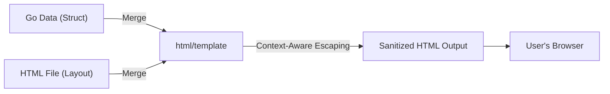

# MC.3 HTML Templates

## Mission

Learn how to build dynamic web pages using Go's `html/template` package, master the concept of template caching, and understand how Go automatically protects your users from security vulnerabilities.

## Prerequisites

- `MC.2` dependency-injection

## Mental Model

Think of a Template as **A Custom Printing Press**.

1. **The Plate (The Template)**: You carve the layout of the page into a metal plate. This plate has "holes" for things like the `{{.Title}}` or `{{.Content}}`.
2. **The Ink (The Data)**: You prepare the specific information for a single page (The Data Struct).
3. **The Press (The Execute Function)**: You put the plate and the ink into the press. The machine precisely fills the holes with the ink and produces a finished page.
4. **The Security Guard (Auto-Escaping)**: If someone tries to give you "ink" that is actually acid (A Malicious Script), the press automatically neutralizes it before it hits the paper, so it doesn't harm the person reading the page.

## Visual Model



## Machine View

The `html/template` package is significantly more advanced than the standard `text/template` package found in many other languages.
- **Parsing the AST**: When you parse a template, Go actually builds an Abstract Syntax Tree of the HTML. It knows that `<a href="{{.URL}}">` is a URL context and `<script>var x = {{.Data}};</script>` is a JavaScript context.
- **Auto-Escaping**: Depending on where the data is placed, Go applies different escaping rules. In HTML, it converts `<` to `&lt;`. In a URL, it converts spaces to `%20`.
- **Performance**: Because parsing the AST is slow, you should **never** parse your templates inside an HTTP handler. Instead, parse them once when your application starts and store the result in your `application` struct.

## Run Instructions

```bash
go run ./06-backend-db/01-web-and-database/web-masterclass/3-templates
```

Visit `http://localhost:8082` in your browser to see the rendered template.

## Code Walkthrough

### `html/template` vs `text/template`
Always use `html/template` for web output. It shares the same syntax as `text/template` but adds the critical security layer of context-aware escaping.

### `template.New("name").Parse(string)`
Compiles the template string into an internal representation. In a larger project, you would use `template.ParseFiles` or `template.ParseGlob` to load files from your disk.

### `tmpl.Execute(w, data)`
Combines the compiled template with a Go data structure (usually a `struct` or a `map`) and writes the result to the `http.ResponseWriter`.

### `{{range .Items}} ... {{end}}`
The built-in loop construct for templates. It iterates over a slice or map and sets the context (`.`) to the current item inside the loop.

## Try It

1. Try to pass a string containing `<script>alert('XSS')</script>` as the `Title` and observe how it appears in the browser (it should be visible as text, not executed as a script).
2. Add a `{{if .IsAdmin}} ... {{end}}` block to the template to show a special message only if a boolean flag is set to true.
3. Use a nested struct to pass more complex data to the template.

## In Production
**Cache your templates!** Parsing templates from disk on every request is a major performance bottleneck. For production apps, use `//go:embed` to bundle your templates into the binary so you don't have to worry about file paths on the server.

## Thinking Questions
1. Why doesn't Go use simple string replacement for its templates?
2. What is the difference between `{{.}}` and `{{.Name}}` inside a template?
3. How would you handle a global layout (Header/Footer) that is shared across 50 different pages? (Hint: Look up "Template Composition").

> **Forward Reference:** You can now present data. But how do you handle cross-cutting concerns like logging every request, recovering from panics, or adding security headers? In [Lesson 4: Middleware](../4-middleware/README.md), you will learn the "Decorator" pattern for HTTP handlers.

## Next Step

Continue to `MC.4` middleware.
