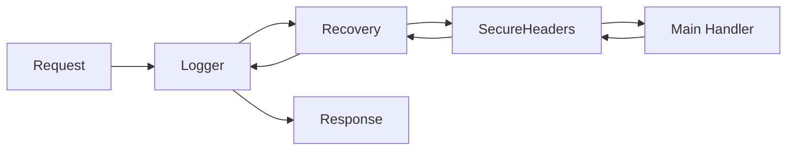

# MC.4 Middleware

## Mission

Master the "Decorator" pattern in Go web development by learning how to build and chain middleware to handle logging, security, and error recovery in a centralized and reusable way.

## Prerequisites

- `MC.3` templates

## Mental Model

Think of Middleware as **Layers of an Onion**.

1. **The Core (The Handler)**: The actual logic that creates the response (e.g., "Return the list of users").
2. **The Inner Layer (Security)**: Before the request reaches the core, it passes through a security check.
3. **The Middle Layer (Logging)**: Before it reaches security, it is logged so you know it arrived.
4. **The Outer Layer (Recovery)**: This is the shell. If the onion "explodes" (A Panic) anywhere inside, this layer catches the mess and prevents the whole system from crashing.
5. **The Flow**: Every request travels from the outside in to the core, and then the response travels from the core back out through every layer to the user.

## Visual Model



## Machine View

In Go, middleware relies on the fact that `http.Handler` is an interface with a single method: `ServeHTTP(ResponseWriter, *Request)`.
- **The Wrapper**: A middleware function takes a `http.Handler` as input and returns a *new* `http.Handler` as output.
- **The Delegation**: The new handler does some work and then calls `next.ServeHTTP()`. This is how the request "moves down" the chain.
- **The Return Path**: Once `next.ServeHTTP()` returns, the middleware can perform more work. This is where you calculate request latency or log the final status code.

## Run Instructions

```bash
go run ./06-backend-db/01-web-and-database/web-masterclass/4-middleware
```

Visit `http://localhost:8083` to see logs in your terminal. Visit `http://localhost:8083/panic` to see how the server recovers from a crash.

## Code Walkthrough

### The Middleware Signature
`func (next http.Handler) http.Handler` is the standard way to write middleware in Go. It's simple, powerful, and requires no external libraries.

### `http.HandlerFunc`
We use this type-cast to turn an anonymous function into something that satisfies the `http.Handler` interface.

### `recover()`
Used inside a `deferred` function to catch a panic. If a panic occurs, `recover()` returns the error value, allowing you to log it and return a friendly 500 error instead of letting the entire process exit.

### Middleware Chaining
`handler := A(B(C(mux)))`. The outermost function (`A`) is the first to receive the request and the last to finish processing the response.

## Try It

1. Add a `BasicAuth` middleware that checks for a specific username and password in the headers before allowing the request to proceed.
2. Create a middleware that limits the maximum size of a request body (essential for preventing "Zip Bomb" or "Denial of Service" attacks).
3. Change the order of the middleware and observe how the logs change.

## In Production
**Don't reinvent the wheel for standard middleware.**
While writing your own middleware is a great way to learn, for production you should use well-tested libraries like **gorilla/handlers** or **chi/middleware** for complex tasks like CORS (Cross-Origin Resource Sharing) or Gzip compression.

## Thinking Questions
1. Why should the `Recovery` middleware usually be near the "outside" of the chain?
2. How can you pass data from a middleware down to a handler? (Hint: Look up `context.WithValue`).
3. What is the performance cost of having 50 layers of middleware?

> [!TIP]
> You've secured and monitored your server. But how do you remember a user across multiple requests? In [Lesson 5: Sessions](../5-sessions/README.md), you will learn how to use cookies and session stores to build stateful web applications.

## Next Step

Continue to `MC.5` sessions.
