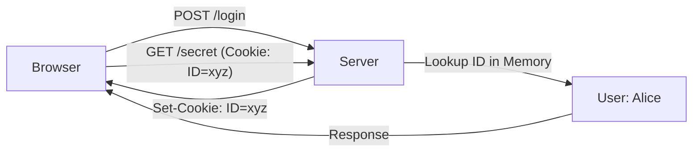

# MC.5 Sessions

## Mission

Understand how to bridge the stateless nature of HTTP by using Cookies and Server-Side Sessions to securely track users across multiple requests.

## Prerequisites

- `MC.4` middleware

## Mental Model

Think of a Session as **A Coat Check at a Museum**.

1. **The Entrance (Login)**: You arrive at the museum and hand the attendant (The Server) your coat.
2. **The Ticket (The Cookie)**: The attendant gives you a small plastic ticket with the number `42` (The Session ID).
3. **The Visit (Multiple Requests)**: You walk around the museum. Every time you want to enter a special gallery (A Protected Route), you show the guard your ticket `42`.
4. **The Security**: You don't carry your heavy coat (Your User Data) around with you. You only carry the small ticket. If someone steals your ticket, they can take your coat, but they can't change what kind of coat it is.
5. **The Exit (Logout)**: When you leave, you trade your ticket back for your coat. The attendant throws away the record for ticket `42`.

## Visual Model



## Machine View

A session involves two parts: a **Client-Side Identifier** and a **Server-Side Store**.
- **The Cookie**: The browser stores the session ID. In Go, we use `http.SetCookie`. We must set `HttpOnly: true` to prevent JavaScript from reading the cookie (protecting against XSS) and `SameSite: Lax` to protect against CSRF attacks.
- **The Store**: The server keeps a map (or a database like Redis) where the ID is the key and the user's information is the value.
- **Thread Safety**: Because Go handles every request in a separate goroutine, your session store (if it's a map) must be protected by a `sync.RWMutex` to prevent data races.

## Run Instructions

```bash
go run ./06-backend-db/01-web-and-database/web-masterclass/5-sessions
```

1. Visit `/secret` and see it fail.
2. Visit `/login` to set the cookie.
3. Visit `/secret` again to see the authenticated response.

## Code Walkthrough

### `http.SetCookie(w, cookie)`
The standard way to send a `Set-Cookie` header to the browser. The `Cookie` struct allows you to set the expiration, path, and security flags.

### `r.Cookie("name")`
Retrieves a cookie from the incoming request. If the cookie doesn't exist, it returns an error, which you can use to identify unauthorized requests.

### `sync.RWMutex`
Used to protect the `sessionStore` map. `Lock()` is used for writes (Login), and `RLock()` is used for reads (Secret), allowing multiple concurrent readers while ensuring exclusive access for writers.

### `crypto/rand`
We use cryptographically secure random numbers to generate Session IDs. A simple `math/rand` number is too predictable and could allow an attacker to "guess" another user's session ID.

## Try It

1. Change the `HttpOnly` flag to `false` and try to read the cookie using `document.cookie` in your browser's console. Then change it back and see it disappear.
2. Add an expiration time to the cookie (e.g., 1 minute) and observe how the browser deletes it automatically.
3. Implement a `handleLogout` function that clears the cookie and removes the ID from the server-side map.

## In Production
**Don't use in-memory maps for production sessions.**
If your server restarts, every single user will be logged out. Instead, use a persistent store like **Redis** or a **Database**. This also allows you to run multiple instances of your server behind a load balancer (Horizontal Scaling), as they can all share the same session data.

## Thinking Questions
1. Why shouldn't you store a user's password or email address directly in a cookie?
2. What is the benefit of the `HttpOnly` flag?
3. What happens to your in-memory sessions if you have two copies of your server running?

> **Forward Reference:** You can now keep users logged in. But how do you verify who they are in the first place? In [Lesson 6: Authentication](../6-auth/README.md), you will learn how to securely handle passwords and protect your routes.

## Next Step

Continue to `MC.6` authentication.
