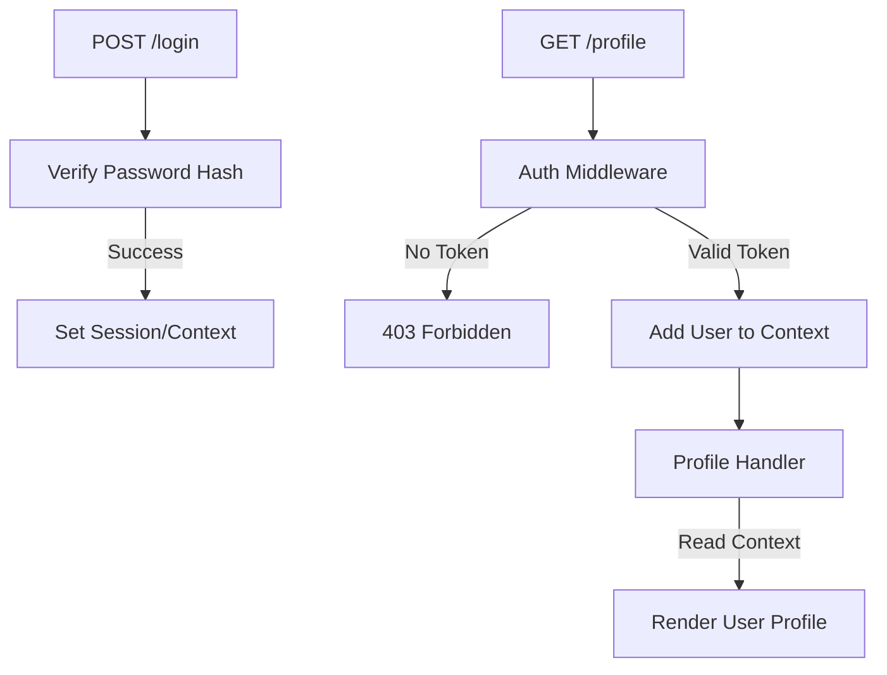

# MC.6 Authentication

## Mission

Master the core security patterns of web development by learning how to safely store passwords, verify user identity, and protect sensitive routes using context-aware middleware.

## Prerequisites

- `MC.5` sessions

## Mental Model

Think of Authentication as **The ID Check at a High-Security Building**.

1. **The Registration (Creating the Badge)**: You tell the security office who you are and choose a password. They don't write your password down. Instead, they run it through a shredder (The Hash) and keep the shredded bits along with a handful of glitter (The Salt).
2. **The Login (The Challenge)**: When you return, you say your name and password. They shred your attempt, add the same glitter, and see if the bits look identical to what they have on file.
3. **The Escort (The Context)**: Once verified, a guard (The Middleware) walks with you through the building. The guard knows exactly who you are, so you don't have to re-identify yourself at every door.
4. **The Access**: When you reach your office (The Handler), the guard confirms you're allowed in based on the badge they're carrying for you.

## Visual Model



## Machine View

- **Hashing**: A one-way function. You can turn `password` into a hash, but you can't turn the hash back into `password`.
- **Bcrypt**: Unlike simple hashing algorithms (like SHA-256), bcrypt is an "Adaptive" algorithm. It is intentionally slow to prevent brute-force attacks.
- **Auto-Salting**: Bcrypt generates and manages its own "Salt" (a random string) and stores it inside the final hash string. You don't need to store the salt in a separate database column.
- **Context Propagation**: The `context.Context` object travels with every `http.Request`. It is the perfect place to store a pointer to the current `User` object so that any downstream middleware or handlers can access it without re-querying the database.

## Run Instructions

```bash
go run ./06-backend-db/01-web-and-database/web-masterclass/6-auth
```

1. Register a user using `curl -X POST -d "username=alice&password=secret" http://localhost:8085/register`.
2. Access the profile using `curl http://localhost:8085/profile?user=alice`.

## Code Walkthrough

### Password Hashing (Bcrypt)
We use `golang.org/x/crypto/bcrypt`. `GenerateFromPassword` handles the hashing and salting, while `CompareHashAndPassword` handles the verification.

### `context.WithValue`
This function returns a *new* copy of the context with the provided key and value attached. We then pass this new context down the line using `r.WithContext(ctx)`.

### Custom Context Keys
We use a custom `contextKey` type instead of a plain `string`. This prevents "Key Collisions" if multiple packages try to store data in the context using the same name (like "user").

### Auth Middleware
This function intercepts every request to protected routes. It acts as a gatekeeper: if the user isn't identified, the request is stopped immediately with an error.

## Try It

1. Try to register two users with the same password and observe that their hashes are different because of the salt.
2. Modify the middleware to check for a specific header (e.g., `X-Auth-Token`) instead of a query parameter.
3. What happens if you try to access `/profile` without the `?user=...` parameter?

## In Production
**USE BCRYPT.**
SHA-256 is too fast. Modern computers can calculate billions of SHA-256 hashes per second, making them vulnerable to "Brute Force" attacks. Algorithms like `bcrypt`, `scrypt`, and `argon2` are designed to be "Slow," making it impossible for hackers to guess millions of passwords even with powerful hardware.

## Thinking Questions
1. Why is storing a plain text password the ultimate sin of backend development?
2. How does using a `Salt` protect against Rainbow Tables?
3. What is the difference between "Authentication" and "Authorization"?

> [!TIP]
> You can identify users. Now let's learn how to interact with them through data. In [Lesson 7: Working with Forms](../7-forms/README.md), you will learn how to safely parse and validate user input from HTML forms.

## Next Step

Continue to `MC.7` forms.
