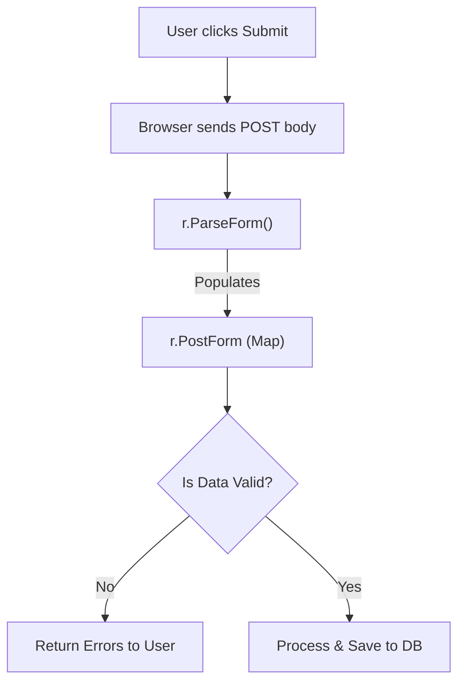

# MC.7 Working with Forms

## Mission

Learn how to safely process user input from HTML forms, implement robust server-side validation, and protect your application from malformed or malicious data.

## Prerequisites

- `MC.6` authentication

## Mental Model

Think of a Form as **A Customer Order Form at a Warehouse**.

1. **The Blank Form (The GET Request)**: The warehouse hands the customer a blank piece of paper with boxes for "Item Number" and "Quantity".
2. **The Filled Form (The POST Request)**: The customer fills it out and hands it back.
3. **The Verification (The Validation)**: Before looking for the item, the warehouse clerk checks if the customer actually wrote something in the boxes and if the "Quantity" is a real number.
4. **The Security**: Even if the customer writes "Item: FREE_GOLD_BAR" on the paper, the clerk checks it against their own internal catalog. The customer can't change the warehouse rules just by writing on the form.

## Visual Model



## Machine View

When a form is submitted with `method="POST"`, the browser encodes the data into a format called `application/x-www-form-urlencoded` (which looks like `email=alice%40example.com&password=secret`).
- **Parsing**: Go does not automatically parse the request body for every request (as this would be a waste of CPU for simple GET requests). You must explicitly call `r.ParseForm()` or `r.ParseMultipartForm()`.
- **Memory Limits**: Go's standard library has built-in protections that limit how much memory a form can consume, protecting you from "Zip Bomb" style attacks.
- **PostForm vs Form**: `r.PostForm` only contains data from the request body (the safe way). `r.Form` contains data from both the body AND the URL query string (use with caution).

## Run Instructions

```bash
go run ./06-backend-db/01-web-and-database/web-masterclass/7-forms
```

Open your browser to `http://localhost:8086`, try submitting empty fields, and observe the validation errors.

## Code Walkthrough

### `r.ParseForm()`
Reads the request body and populates `r.PostForm`. It is a good practice to check the error returned by this function, although it rarely fails for standard forms.

### `r.PostFormValue("key")`
A convenient helper that calls `r.ParseForm()` for you automatically and returns the first value for the given key. If the key doesn't exist, it returns an empty string.

### Server-Side Validation
This is the most important part of form handling. Never rely on HTML5 attributes like `required` or `type="email"`. An attacker can easily bypass these using `curl` or browser developer tools. Always re-validate everything on the server.

### Error Display
If validation fails, you should re-render the form with helpful error messages, allowing the user to correct their mistakes without losing their previously entered data.

## Try It

1. Add a second "Confirm Password" field and validate that it matches the original password.
2. Use a regular expression (regex) to validate that the email field contains a valid `@` symbol.
3. Try to submit the form using `curl` with a missing field: `curl -X POST -d "email=alice@example.com" http://localhost:8086/signup`.

## In Production
**Sanitize your output.**
If you display a user's input back to them (e.g., "Registration successful for <username>"), ensure you use Go's `html/template` or `html.EscapeString` to prevent the user from injecting malicious HTML into your page.

## Thinking Questions
1. Why is `r.PostForm` generally safer than `r.Form`?
2. What happens if a form has two inputs with the same name? How do you access both values?
3. How would you handle a file upload (like a profile picture) in a form? (Hint: Look up `multipart/form-data`).

> **Forward Reference:** You can now handle user input safely. Now let's build something real! In [Lesson 8: Posts CRUD](../8-posts-crud/README.md), you will combine everything you've learned-routing, templates, databases, and forms-to build a complete Create, Read, Update, Delete feature.

## Next Step

Continue to `MC.8` posts-crud.
