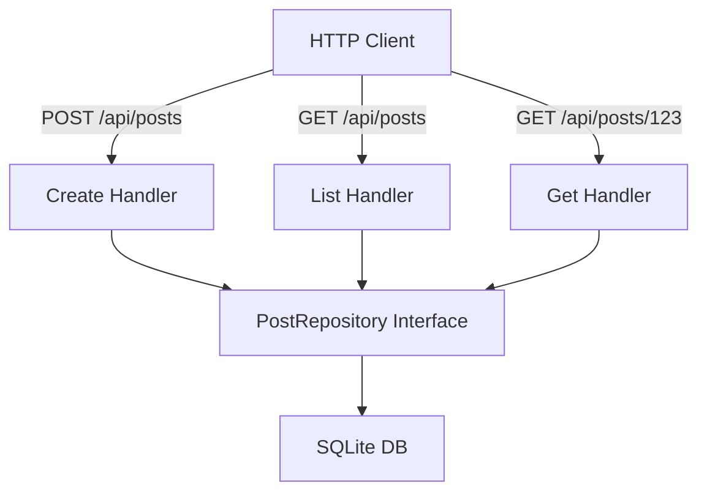

# MC.8 Posts CRUD

## Mission

Bring together everything you've learned-routing, dependency injection, databases, and forms-to build a complete, professional-grade Create, Read, Update, and Delete (CRUD) system for a blog.

## Prerequisites

- `MC.7` forms

## Mental Model

Think of a CRUD system as **A Library Management System**.

1. **CREATE (Donate a Book)**: You fill out a form with the title and content, and the librarian (The Server) adds it to the shelf (The Database) and gives it a unique ID number.
2. **READ (Browse the Shelves)**: You ask for all the books (List) or a specific book by its ID number (Get). The librarian finds them for you.
3. **UPDATE (Edit a Book)**: You notice a typo in a book and ask the librarian to fix it. They find the book by its ID and overwrite the old text with the new text.
4. **DELETE (Remove a Book)**: A book is outdated, so you ask the librarian to remove it from the shelf permanently.

## Visual Model



## Machine View

In a professional CRUD system, we strictly follow RESTful conventions:
- **POST**: Create a new resource. The server should return a `201 Created` status code and the ID of the new resource.
- **GET**: Retrieve a resource or a list of resources.
- **PUT/PATCH**: Update an existing resource.
- **DELETE**: Remove a resource.
Each operation uses the database context properly. For example, the `Get` operation uses `QueryRowContext` because we expect exactly one result. The `List` operation uses `QueryContext` to stream multiple rows.

## Run Instructions

```bash
go run ./06-backend-db/01-web-and-database/web-masterclass/8-posts-crud
```

Use `curl` to interact with the API:
- Create: `curl -X POST -d '{"title":"Hello","content":"World"}' http://localhost:8087/api/posts`
- List: `curl http://localhost:8087/api/posts`
- Get: `curl http://localhost:8087/api/posts/1`

## Code Walkthrough

### Repository Abstraction
The `PostRepository` interface is the heart of the system. It defines exactly what we can do with posts without specifying *how* they are stored. This makes the code much easier to test and maintain.

### JSON Decoding
We use `json.NewDecoder(r.Body).Decode(&input)` to parse incoming JSON directly from the request stream. This is more memory-efficient than reading the entire body into a string first.

### Path Parameter Extraction
We use `r.PathValue("id")` and `strconv.Atoi()` to safely extract and convert the resource ID from the URL.

### Status Code Discipline
We use specific HTTP status codes:
- `201 Created` for successful creation.
- `400 Bad Request` for invalid input (e.g., malformed JSON).
- `404 Not Found` for resources that don't exist.
- `500 Internal Server Error` for unexpected database failures.

## Try It

1. Implement the `Update` and `Delete` methods in both the interface and the SQL repository.
2. Add validation to the `handleCreate` function to ensure that the title is not empty.
3. Add an `Author` field to the `Post` struct and update the database schema and queries to support it.

## In Production
**Don't forget pagination.**
As your blog grows to thousands of posts, a simple `SELECT * FROM posts` will become incredibly slow and could crash your server. Always implement limits and offsets (Pagination) for any route that returns a list of resources.

## Thinking Questions
1. Why do we separate the Repository from the Handlers?
2. What is the benefit of returning a `201 Created` status code instead of a simple `200 OK`?
3. How would you handle a scenario where two users try to update the same post at the exact same time?

> **Forward Reference:** You've built a solid CRUD system. But how do you handle thousands of records without slowing down? In [Lesson 9: Pagination](../9-pagination/README.md), you will learn the standard patterns for slicing and dicing large datasets for the web.

## Next Step

Continue to `MC.9` pagination.
