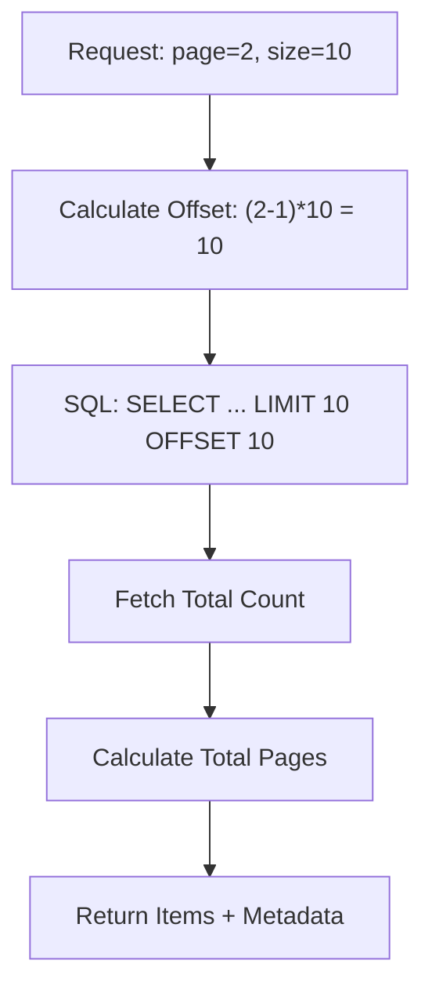

# MC.9 Pagination

## Mission

Learn how to manage large datasets efficiently by implementing pagination, ensuring your application stays fast and responsive even when dealing with thousands of records.

## Prerequisites

- `MC.8` posts-crud

## Mental Model

Think of Pagination as **The Index of a Large Encyclopedia**.

1. **The Problem (The One Big Book)**: If all the information in the encyclopedia was in one single, 10,000-page book, it would be impossible to lift and take forever to find anything.
2. **The Solution (The Volumes)**: You split the information into 26 separate volumes (The Pages).
3. **The Metadata (The Spine Labels)**: Each volume has a label on the spine telling you exactly what is inside ("A-B", "Volume 1 of 26").
4. **The Navigation**: If you finish Volume 1 and need more information, you know exactly which volume to pick up next. You never have to hold more than one volume at a time.

## Visual Model



## Machine View

- **LIMIT**: Tells the database the maximum number of rows to return. This is your "Page Size."
- **OFFSET**: Tells the database how many rows to skip before it starts returning data.
- **The Offset Penalty**: On a machine level, `OFFSET 1000` is much more expensive than `OFFSET 10`. The database engine must literally "walk" through the first 1,000 rows to find the 1,001st row.
- **Consistent Results**: For pagination to work correctly, you **must** use an `ORDER BY` clause. Without it, the database might return rows in a different order on each request, causing items to be skipped or repeated across pages.

## Run Instructions

```bash
go run ./06-backend-db/01-web-and-database/web-masterclass/9-pagination
```

Open `http://localhost:8088/api/items?page=1` and change the `page` parameter to see how the metadata and data change.

## Code Walkthrough

### Query Parameter Parsing
We use `r.URL.Query().Get("page")` and `strconv.Atoi` to read the user's requested page. We always provide a default (Page 1) in case the parameter is missing or invalid.

### Metadata Calculation
We calculate the `TotalPages` using `math.Ceil(TotalRecords / PageSize)`. This ensures that if we have 105 items and a page size of 10, we correctly identify that there are 11 pages (10 full pages and 1 partial page).

### The JSON Envelope
Instead of returning a simple array, we return an object that contains both the `items` (the data) and the `metadata` (the context). This allows the frontend to know how many page buttons to render.

### Range Logic
In the example, we simulate a database by slicing a local array. We use careful boundary checks (`if end > totalItems { end = totalItems }`) to prevent "Index Out of Range" panics.

## Try It

1. Change the `pageSize` to 20 and see how many total pages are calculated.
2. Add a `has_prev` boolean to the `Metadata` struct and implement the logic to set it to true if the current page is greater than 1.
3. Try to request a page number that doesn't exist (e.g., `page=999`). How does your code handle it?

## In Production
**Set a Maximum Page Size.**
Never let a user specify their own page size without a limit (e.g., `page_size=1000000`). This is a common way to crash a server by exhausting its memory. Always cap the page size at a reasonable limit like 100.

## Thinking Questions
1. Why is an `ORDER BY` clause mandatory for reliable pagination?
2. What are the downsides of `OFFSET` pagination for very large datasets?
3. How would you handle pagination if your items were being added to the database every second (like a Twitter feed)?

> [!TIP]
> You've mastered the data. Now let's add some social features! In [Lesson 10: Comments & Nesting](../10-comments/README.md), you will learn how to handle hierarchical data relationships in your web application.

## Next Step

Continue to `MC.10` comments.
