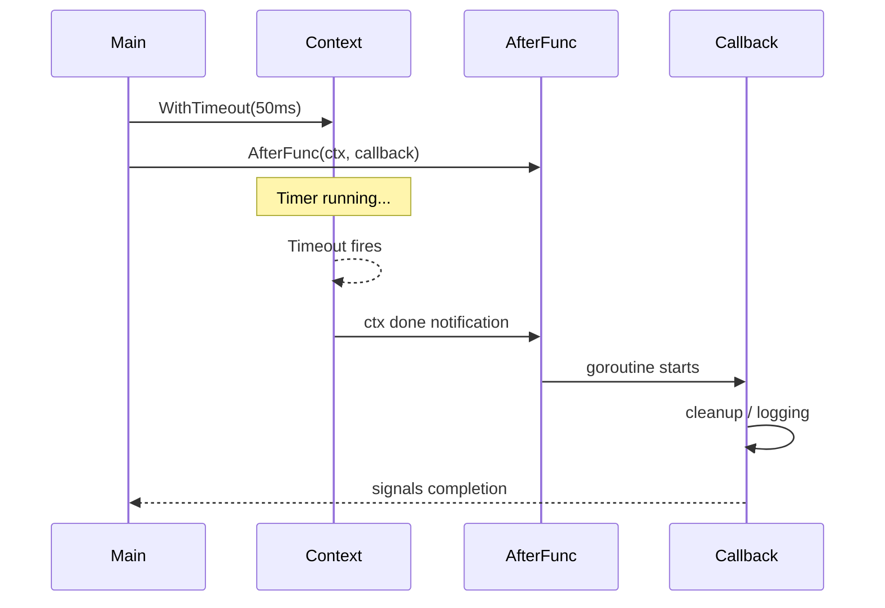

# CT.6 context.AfterFunc

## Mission

Schedule callbacks that fire when a context is cancelled, using `context.AfterFunc` for efficient one-shot cleanup and side-effect handling.

## Prerequisites

- `CT.2` with-cancel
- `CT.3` with-timeout

> [!NOTE]
> In [CT.2 WithCancel](../02-with-cancel/README.md), you learned how to cancel contexts manually. In [CT.3 WithTimeout](../03-with-timeout/README.md), you learned how to set deadlines. `context.AfterFunc` builds on these by letting you attach callbacks that fire automatically on cancellation.

## Mental Model

Think of `AfterFunc` as setting an **alarm clock** that rings when the context is cancelled. Instead of starting a separate goroutine to watch `ctx.Done()`, you tell the context: "When someone pulls the plug, call this function." If the context is already cancelled when you register the callback, the alarm rings immediately.

## Visual Model



## Machine View

`AfterFunc` is more efficient than starting a goroutine with a `select` on `ctx.Done()` for a single callback. The Go runtime registers the callback directly on the context's internal cancellation list. When the context is cancelled, the runtime iterates the list and launches each callback in its own goroutine. This avoids the memory and scheduling overhead of an idle goroutine.

## Run Instructions

```bash
go run ./07-concurrency/01-concurrency/01-context/06-afterfunc
```

## Code Walkthrough

- **Timeout with cleanup**: `context.AfterFunc(ctx, callback)` registers a cleanup function that fires when the timeout expires. The callback runs in its own goroutine.
- **Cancelled context**: If the context is already cancelled when `AfterFunc` is called, the callback fires immediately in a new goroutine.
- **Stopping the callback**: `AfterFunc` returns a `stop` function. Calling `stop()` prevents the callback from firing if the context hasn't been cancelled yet.

> [!TIP]
> Use `AfterFunc` for side effects that should happen exactly once on cancellation. For polling or multiple events, use a goroutine with `select` on `ctx.Done()`. Next, in [TM.1 Time](../../04-time-and-scheduling/01-time/README.md), you'll learn the `time` package for scheduling and duration manipulation.

## Try It

1. Change the timeout from `50ms` to `200ms` and observe how the callback timing changes.
2. Remove the `stop()` call in the third example and verify that the callback still fires even though the context is cancelled afterward.
3. Use `AfterFunc` on a `context.WithCancel` and call `cancel()` manually to trigger the callback.

## In Production

`AfterFunc` is used for database connection pool cleanup on request cancellation, cache invalidation when a context times out, and recording metrics when an operation is cancelled. Because it avoids idle goroutines, it's the preferred pattern for single-shot cancellation side effects in high-throughput services.

## Thinking Questions

1. Why does `AfterFunc` run the callback in a new goroutine instead of synchronously?
2. What happens if the callback passed to `AfterFunc` blocks indefinitely?
3. How is `AfterFunc` different from a goroutine with `<-ctx.Done()` in a `select` statement?

## Next Step

Next: `TM.1` -> [`07-concurrency/01-concurrency/04-time-and-scheduling/01-time`](../../04-time-and-scheduling/01-time/README.md)
