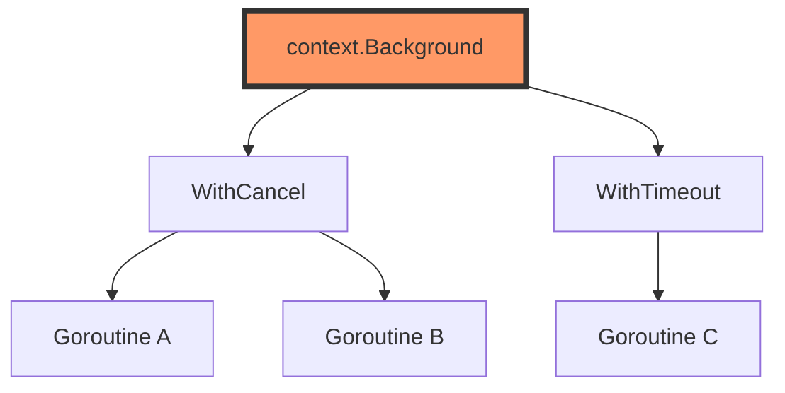

# CT.1 Context: The Root of All Concurrency

## Mission

Understand what `context.Context` is and why it's the "Glue" that holds Go's concurrent systems together. Learn to create the root of a context tree using `Background()` and recognize the semantic meaning of `TODO()`.

## Prerequisites

- `GC.0` to `GC.10`

## Mental Model

Think of `context.Context` as **A Briefcase for a Secret Mission**.

1. **The Briefcase (`Context`)**: Every agent (goroutine) is given a briefcase when they start their task.
2. **The Root (`Background`)**: The mission begins at headquarters. The First Agent gets the original briefcase.
3. **The Placeholder (`TODO`)**: You know you need a briefcase, but you haven't decided what should be inside it yet.
4. **Propagation**: When an agent hires a subcontractor (spawns a new goroutine), they pass a copy of the briefcase to the new agent. If the First Agent's mission is aborted, everyone carrying a copy of that briefcase knows to stop immediately.

## Visual Model



## Machine View

At its core, `context.Context` is an interface with four methods:
- `Deadline()`: When should I stop?
- `Done()`: Am I stopped yet? (A channel that closes on cancellation).
- `Err()`: Why was I stopped?
- `Value()`: What extra data am I carrying?

`context.Background()` returns an internal `emptyCtx` struct. It is an immutable, empty root that never cancels. It has no memory footprint (it's a pointer to a global variable).

## Run Instructions

```bash
go run ./07-concurrency/01-concurrency/context/1-background
```

## Code Walkthrough

### `context.Background()`
This is your starting point. You use it in `main()`, in tests, or at the top level of a request (like an HTTP handler). It never expires and never carries data.

### `context.TODO()`
`TODO()` is technically identical to `Background()`. However, using `TODO()` tells other developers (and static analysis tools) that you **intend** to provide a real context later but haven't wired it through the call stack yet.

### The First Parameter Convention
In Go, `context.Context` is **always** the first parameter of a function:
`func DoWork(ctx context.Context, name string) error`
This makes it impossible to miss that a function is part of a concurrent, cancellable call chain.

## Try It

1. Try calling `ctx.Done()` on the background context. Notice it returns `nil`. Reading from a `nil` channel blocks forever-which is why you should always check `Err()` or use `select`.
2. Replace `context.Background()` with `context.TODO()`. Does the output change?
3. Create a function that takes a context and prints `ctx.Err()`. Pass it the background context.

## Verification Surface

Observe the behavior of the immutable root contexts:

```text
=== Context: Background & TODO ===

Background context: context.Background
Has deadline: false (deadline: 0001-01-01 00:00:00 +0000 UTC)
Done channel: <nil> (nil = never cancels)
Error: <nil>

TODO context: context.TODO

Processing order: order-123
  Context error: <nil> (nil = still active)
```

## In Production
**Do not store Contexts inside a struct.**
Contexts are meant to be passed down the **Call Stack** as parameters. Storing them in a struct makes their lifetime ambiguous and can lead to goroutine leaks if the struct outlives the request it was meant for. The only exception is in rare cases like HTTP Request objects.

## Thinking Questions
1. Why is `Context` an interface instead of a concrete struct?
2. Why is `ctx.Done()` a channel instead of a boolean function? (Hint: `select`!).
3. If `Background()` and `TODO()` behave identically, why does Go provide both?

## Next Step

Next: `CT.2` -> `07-concurrency/01-concurrency/context/2-with-cancel`

Open `07-concurrency/01-concurrency/context/2-with-cancel/README.md` to continue.
