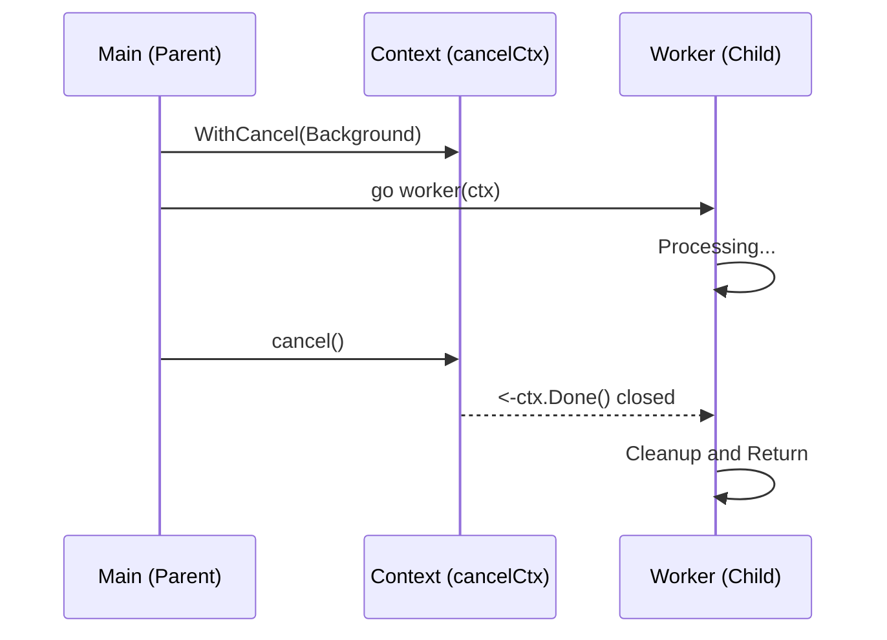

# CT.2 Context Cancellation: Pulling the Plug

## Mission

Learn how to stop goroutines on command using `context.WithCancel`. Master the standard pattern for cancellation-aware workers and understand why `defer cancel()` is non-negotiable for production Go engineers.

## Prerequisites

- `CT.1` background

## Mental Model

Think of Context Cancellation as **The Fire Alarm in a Factory**.

1. **The Factory (`Worker Goroutine`)**: People are working at their stations.
2. **The Alarm (`ctx.Done()`)**: When someone pulls the alarm (`cancel()`), a bell rings throughout the whole building.
3. **The Response**: Every worker must stop what they are doing immediately, drop their tools, and exit the building (return).
4. **The Cleanup**: Once everyone has left, the power to the building can be safely turned off.

## Visual Model



## Machine View

When you call `context.WithCancel(parent)`, Go allocates a `cancelCtx` struct.
- **Done Channel**: It creates a channel `chan struct{}`. This channel is never sent any data; it is only ever **closed**.
- **Broadcast**: Because closing a channel unblocks **all** goroutines currently waiting on it, this acts as a perfect broadcast signal.
- **Hierarchy**: The `cancelCtx` adds itself to the `children` map of its parent. If the parent is cancelled, it iterates through its children and calls their `cancel` functions too.

## Run Instructions

```bash
go run ./07-concurrency/01-concurrency/context/2-with-cancel
```

## Code Walkthrough

### `context.WithCancel`
This function returns a new context and a `cancel` function. **You must always call this function**, usually via `defer cancel()`. This ensures that even if your function returns early due to an error, the context tree is cleaned up.

### `<-ctx.Done()`
This is the "Ear to the Ground." Inside a `select` statement, this case will trigger the moment `cancel()` is called.

### Propagation
The second half of the demo shows that cancelling a single "Parent" context automatically cancels all its "Children." This is how you can shut down a complex web service with a single signal.

## Try It

1. Remove the `cancel()` call in the first example. What happens to the worker? (Hint: It keeps running until the program exits, which in a real server would be a memory leak).
2. Remove `time.Sleep` from the worker. Does it catch the cancellation faster or slower?
3. Create a tree three levels deep. Cancel the middle context. Verify that the child is cancelled but the parent stays alive.

## Verification Surface

Observe the graceful exit and the error status after cancellation:

```text
=== Context: WithCancel ===

  Received: result-1
  Received: result-2
  Received: result-3

  Calling cancel()...
  Worker stopped: context canceled
  Context error after cancel: context canceled

=== Nested Cancellation ===
  Before cancel - parent err: <nil>, child1 err: <nil>, child2 err: <nil>
  After parent cancel - parent err: context canceled, child1 err: context canceled, child2 err: context canceled
```

## In Production
**Forgetting `cancel()` causes memory leaks.**
Even if your logic is correct, the Go runtime keeps the context in memory (and in its parent's child list) until the `cancel` function is called. In a high-traffic HTTP server, failing to `defer cancel()` can lead to thousands of "Zombies" in memory, eventually causing an Out of Memory (OOM) crash.

## Thinking Questions
1. Why does `cancel()` take no arguments?
2. What happens if you call `cancel()` twice?
3. If a worker is blocked on a network call (`http.Get`), how does `ctx.Done()` help? (Hint: It doesn't, unless the network call also supports Context!).

## Next Step

Next: `CT.3` -> `07-concurrency/01-concurrency/context/3-with-timeout`

Open `07-concurrency/01-concurrency/context/3-with-timeout/README.md` to continue.
