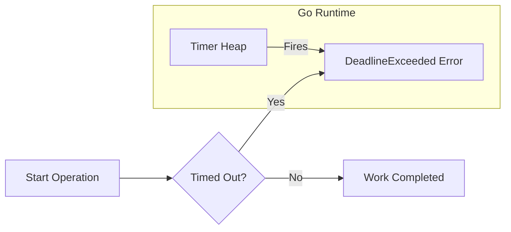

# CT.3 Context Timeouts: Setting Boundaries

## Mission

Master the art of **Defensive Programming** using `context.WithTimeout` and `context.WithDeadline`. Learn how to protect your application from hanging forever on slow network calls, failing databases, or infinite loops.

## Prerequisites

- `CT.2` with-cancel

## Mental Model

Think of Context Timeouts as **A Reservation in a Restaurant**.

1. **The Policy (`WithTimeout`)**: You have a 2-hour table limit.
2. **The Hard Deadline (`WithDeadline`)**: The restaurant closes at 10:00 PM sharp.
3. **The Outcome**:
   - If you finish eating in 1 hour, you pay and leave successfully (Success).
   - If you are still eating when the 2 hours are up, the manager politely asks you to leave (`context.DeadlineExceeded`).
   - If a fire starts in the kitchen, the manager asks everyone to leave immediately (`context.Canceled`).

## Visual Model



## Machine View

- **Timer Heap**: `WithTimeout` is a wrapper for `WithDeadline`. The Go runtime places your context's deadline in a specialized "Timer Min-Heap."
- **Efficiency**: The runtime's background timer goroutine only wakes up when the earliest deadline is reached. This makes Go capable of handling millions of active timeouts with negligible CPU overhead.
- **Cleanup**: If you call `cancel()` (from the `defer`) before the timer fires, the runtime removes your timer from the heap, saving CPU cycles.

## Run Instructions

```bash
go run ./07-concurrency/01-concurrency/context/3-with-timeout
```

## Code Walkthrough

### `context.WithTimeout`
This is the most common way to wrap a context. You provide a `time.Duration` (e.g., `5 * time.Second`). This is essentially a "Self-Destruct" timer for the request.

### `context.WithDeadline`
Use this when you have a specific point in time (e.g., "The end of the current minute"). `WithTimeout(ctx, 10s)` is just shorthand for `WithDeadline(ctx, time.Now().Add(10s))`.

### Distinguishing Errors
- `ctx.Err() == context.DeadlineExceeded`: The clock ran out.
- `ctx.Err() == context.Canceled`: Someone manually called `cancel()`.
Distinguishing these is critical for logging-one is an external bottleneck, the other is an internal intent.

## Try It

1. Change the timeout to `1 second` and the operation duration to `100ms`. Verify that it always succeeds.
2. What happens if you set a timeout of `0` or a negative duration? (Hint: It cancels immediately).
3. Use `ctx.Deadline()` to print the exact timestamp when the context will expire.

## Verification Surface

Observe the two outcomes (Success vs. Timeout):

```text
=== Context: WithTimeout ===

  Starting slow operation (timeout: 200ms)...
  ❌ Operation failed: context deadline exceeded
  Reason: Timeout - deadline exceeded

  Starting fast operation (timeout: 500ms)...
  ✅ Result: operation completed successfully

  Starting operation with absolute deadline...
  Deadline set: 11:29:36.000 (has deadline: true)
  ❌ Failed: context deadline exceeded
```

## In Production
**Never perform I/O without a timeout.**
Whether it's a database query, an HTTP request to another service, or a disk read-**set a timeout**. A service without timeouts is a "Dead Man Walking." Eventually, a downstream dependency will hang, and your service will use up all its goroutines waiting for it, causing a cascading failure.

## Thinking Questions
1. Why does `WithTimeout` still return a `cancel` function?
2. What happens to a child context if you increase the timeout of the parent? (Hint: You can't!).
3. How can you tell if a context has a deadline without calling `Deadline()`?

## Next Step

Next: `CT.4` -> `07-concurrency/01-concurrency/context/4-with-value`

Open `07-concurrency/01-concurrency/context/4-with-value/README.md` to continue.
