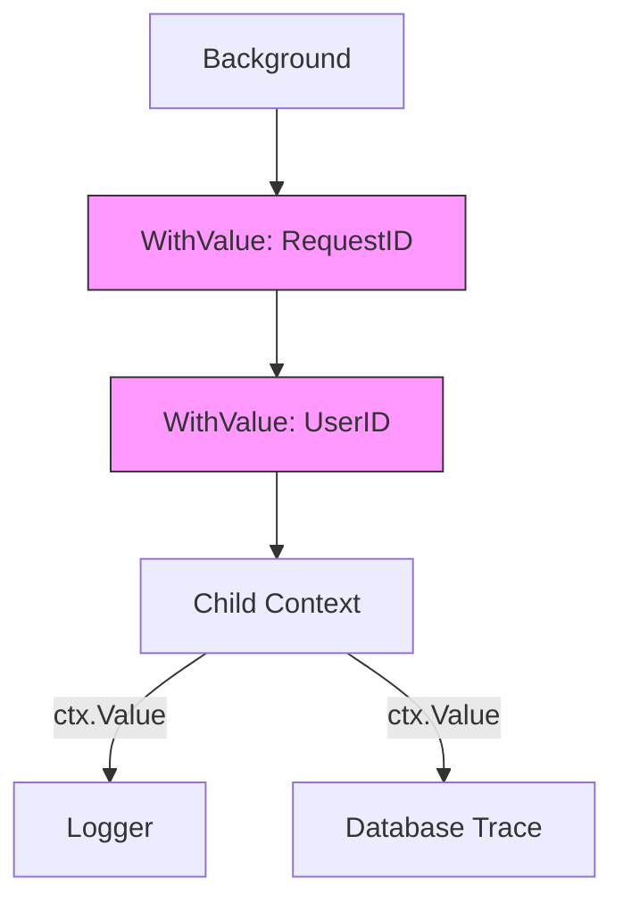

# CT.4 Context Values: Metadata Propagation

## Mission

Learn how to safely carry request-scoped metadata (like User IDs or Request IDs) through a deeply nested call stack using `context.WithValue`. Master the **Custom Key Type** pattern to prevent accidental key collisions in complex Go systems.

## Prerequisites

- `CT.3` with-timeout

## Mental Model

Think of Context Values as **A Boarding Pass for a Flight**.

1. **The Passenger (`The Request`)**: You are moving through the airport (the system).
2. **The Boarding Pass (`Context`)**: This pass stays with you at every checkpoint (function).
3. **The Stamp (`WithValue`)**: At security, they stamp your pass with a "Cleared" status. At the gate, they look at your pass to find your Seat Number (`ctx.Value("seat")`).
4. **The Rule**: You don't use your boarding pass to carry your luggage (database connections). You only use it for **information about the passenger** (metadata).

## Visual Model



## Machine View

- **Linked List**: `WithValue` creates a `valueCtx` struct that contains exactly one key-value pair and a pointer to the `parent` context.
- **Search**: When you call `ctx.Value(key)`, Go checks the current context. If it doesn't match, it follows the pointer to the parent and checks there. This continues until it finds the key or reaches the root.
- **Performance**: Finding a value is an **O(N)** operation where N is the depth of the context tree. While fast, adding 1,000 values to a context will make every lookup slow.
- **Immutability**: You never "update" a context value. You create a new child context that "shadows" the parent's value.

## Run Instructions

```bash
go run ./07-concurrency/01-concurrency/context/4-with-value
```

## Code Walkthrough

### Custom Key Types
`type contextKey string`. This is the single most important pattern in Go context usage. By defining a private type, you guarantee that no other package can accidentally overwrite your keys, even if they use the same string name.

### Value Extraction
`ctx.Value(key).(string)`. Context values are stored as `any` (interface{}), so you must use a **Type Assertion** to get the actual data back.

### The "Request-Scoped" Rule
Only store data that is specific to **this specific execution**.
- **Good**: Request ID, Auth Token, Trace ID, User Locale.
- **Bad**: DB Pool, Logger instance, Config map. These should be passed as explicit dependencies in structs or function arguments.

## Try It

1. Change `requestIDKey` to be a plain `string` instead of a custom type. Does it still work? (Yes, but it's dangerous!).
2. Add a new value `tenantID` to the context and print it in the `logAction` function.
3. Try to "update" the `userID` by creating a new context with the same key but a different value. Observe that the original context remains unchanged.

## Verification Surface

Observe how the values are extracted and inherited by child contexts:

```text
=== Context: WithValue ===

  Handling request: ID=req-abc-123, UserID=42
  [req-abc-123] Action: processing order

=== Child Context Inherits Values ===
  Child sees requestID: req-abc-123
```

## In Production
**Context values are invisible dependencies.**
If a function requires a `UserID` to work, it's usually better to pass it as an explicit argument. Use Context Values only for "transversal" data that needs to be available to 50 different functions (like a Logger's Trace ID) without adding it to every single signature.

## Thinking Questions
1. Why doesn't Go provide a `Set` method for context values?
2. What happens if you try to get a value for a key that doesn't exist?
3. If `ctx.Value` is O(N), how can we store 20 values without killing performance? (Hint: Use a single struct as the value!).

## Next Step

We've mastered all the parts of the Context. Now let's put it to work in a real-world scenario: making an HTTP client that never hangs. Continue to [CT.5 Timeout HTTP Client](../5-timeout-client/README.md).
