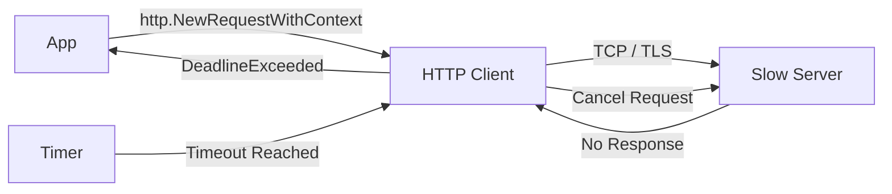

# CT.5 Project: Timeout-Aware API Client

## Mission

Put your context knowledge into practice by building a robust HTTP client. Learn how to protect your application from "Stall" attacks and slow dependencies by enforcing strict timeouts on every outgoing network request.

## Prerequisites

- `CT.4` with-value

## Mental Model

Think of this project as **The Stopwatch at the Bank**.

1. **The Request**: You go to the bank to ask for your balance.
2. **The Stopwatch**: You tell yourself, "If I'm not back in my car in 10 minutes, I'm giving up and leaving."
3. **The Connection**: The bank teller is slow. 10 minutes pass.
4. **The Departure**: Because you had your stopwatch (`context.WithTimeout`), you leave the bank immediately. You are now free to go do other things (like checking another bank) instead of being stuck in line forever.

## Visual Model



## Machine View

When you use `http.NewRequestWithContext(ctx, ...)`:
- The `http.DefaultClient` checks the context at every stage: DNS lookup, TCP dial, TLS handshake, and reading the response body.
- If the context expires at **any** of these stages, the client immediately closes the underlying socket and returns an error.
- This is significantly better than `http.Client.Timeout`, because it allows you to dynamically adjust the timeout based on the specific request or propagate a deadline from an incoming RPC call.

## Run Instructions

```bash
go run ./07-concurrency/01-concurrency/context/5-timeout-client
```

## Solution Walkthrough

- **http.NewRequestWithContext**: This is the modern replacement for `http.NewRequest`. It permanently links the request's lifetime to the context. If you use the older method, the context is ignored, and your request can hang forever.
- **ctx.Err() == context.DeadlineExceeded**: We use this check to provide a helpful error message. It's important to distinguish between "The server is down" (Connection Refused) and "The server is too slow" (Timeout).
- **Resource Cleanup**: Even though the context times out, you must still call `cancel()` via `defer`. This ensures that the context's internal timer is stopped immediately, freeing up CPU resources.


## Try It

1. Change the second example's timeout to `10 seconds`. Watch it succeed after a 3-second delay (httpbin.org/delay/3).
2. Point the client to a URL that doesn't exist. Observe the difference between a "No such host" error and a "Deadline Exceeded" error.
3. Try to fetch a massive file (e.g., 100MB). Set the timeout to `1 second`. Notice how the request is cancelled **while reading the body**.

## Verification Surface

Observe the two outcomes (Success vs. Forced Timeout):

```text
=== Timeout-Aware API Client ===

1️⃣  Fetching httpbin.org with 5s timeout...
   ✅ Response (200 bytes): { "args": {}, ... }

2️⃣  Fetching with impossibly short timeout (1ms)...
   ❌ Expected timeout: request timed out after 1ms: Get "https://httpbin.org/delay/3": context deadline exceeded
```

## In Production
**Set defaults at the Client level too.**
While using a Context per request is best, you should also configure your `http.Client` with a global `Timeout` as a "Last Resort" safety net.
```go
client := &http.Client{
    Timeout: 30 * time.Second,
}
```
In a high-scale microservice architecture, a single service without timeouts can cause a "Deadly Embrace" where every service in the chain gets stuck waiting for each other, leading to a total system blackout.

## Thinking Questions
1. If the server receives the request but the client times out while waiting for the response, does the server know to stop working? (Hint: Only if the server also uses the request context!).
2. Why is `NewRequestWithContext` better than setting `client.Timeout`?
3. How can you use `context.WithValue` to track which requests timed out in your logs?

## Next Step

Next: `TM.1` -> `07-concurrency/01-concurrency/time-and-scheduling/1-time`

Open `07-concurrency/01-concurrency/time-and-scheduling/1-time/README.md` to continue.
