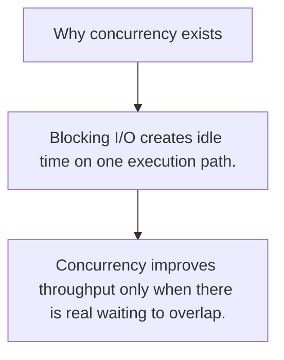

# GC.0 Why concurrency exists

## Mission

Understand why overlapping waits is the reason concurrency exists in everyday backend code.

## Prerequisites

- s06

## Mental Model

Concurrency keeps progress moving while one task is blocked on something slower than the CPU.

## Visual Model



## Machine View

Waiting on I/O parks one execution path. The scheduler can let another goroutine run instead of leaving the CPU idle behind one slow operation.

## Run Instructions

```bash
go run ./07-concurrency/01-concurrency/goroutines/0-why-concurrency-exists
```

## Code Walkthrough

### Blocking I/O creates idle time on one execution path.

Blocking I/O creates idle time on one execution path.

### Goroutines let another task make progress during that 

Goroutines let another task make progress during that wait.

### Concurrency improves throughput only when there is rea

Concurrency improves throughput only when there is real waiting to overlap.

## Try It

1. Change one of the example inputs and rerun the lesson.
2. Explain which boundary the lesson is trying to make explicit.
3. Describe how you would apply GC.0 in a small service or tool.

## ⚠️ In Production

Most network services are dominated by waits. Concurrency helps most when a request fan-out, queue, socket, or disk call spends time blocked.

## 🤔 Thinking Questions

1. What problem does this topic solve?
2. What breaks if this boundary is handled implicitly instead of explicitly?
3. Where would you expect to use this topic in production Go code?

## Next Step

Continue to `GC.1`.
