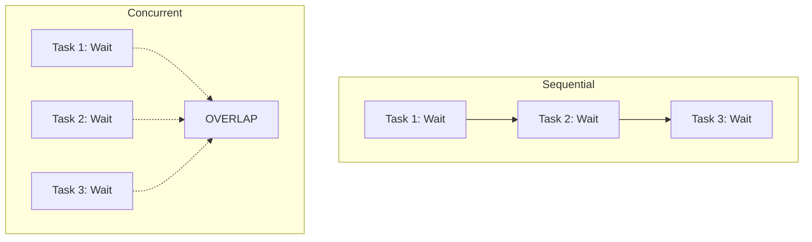

# GC.0 Why Concurrency Exists

## Mission

Understand the fundamental engineering reason for concurrency: **Overlapping Waits**. Learn to distinguish between doing work and waiting for work, and how Go handles the latter.

## Prerequisites

- Section 06: Backend & Databases (To understand I/O boundaries)

## Mental Model

Think of Concurrency as **A Chef in a Kitchen**.

1. **Sequential Chef**: Puts the toast in the toaster. Waits 2 minutes. Toast pops up. Then starts the coffee. Waits 3 minutes. Coffee is done. Total time: **5 minutes**.
2. **Concurrent Chef**: Puts the toast in the toaster. While the toast is toasting (Waiting), starts the coffee. Both are running at the same time. Total time: **3 minutes** (the time of the longest task).

The chef didn't "cook faster." The chef just didn't sit idle while the toaster was doing the work.

## Visual Model



## Machine View

When a program performs I/O (disk, network, database), the CPU is essentially doing nothing for millions of clock cycles.
- In **Sequential** code, the thread of execution is "Blocked." The OS parks the thread, and your program stops moving.
- In **Concurrent** code, when one path blocks, Go's scheduler says: "You wait here. I'm going to let this other path do some work while we wait for that disk/network response."

## Run Instructions

```bash
go run ./07-concurrency/01-concurrency/goroutines/0-why-concurrency-exists
```

## Code Walkthrough

### The Task Simulation
We use `time.Sleep` to simulate **I/O Bound** work. This represents time where the CPU is not working, but the system is waiting for an external result.

### Sequential Loop
The loop waits for Task A to finish before starting Task B. The total time is the **sum** of all wait times.

### The Overlap Concept
In the concurrent simulation, we show that if the tasks can happen at the same time, the total time is only as long as the **single longest task**.

## Try It

1. Add 5 more tasks to the list. Notice how the Sequential time grows linearly, while the Concurrent time stays roughly the same.
2. Change the duration of one task to `500ms`. Observe how the "Concurrent" time is always defined by the "Slowest" task.

## Verification Surface

When you run the code, you should see the throughput gain from overlapping:

```text
Scenario 1: Sequential Execution
Total Time Sequential: 300ms+

Scenario 2: Concurrent Execution
Total Time Concurrent: ~100ms
```

## In Production
Concurrency is not a magic "Go Faster" button for every problem.
- **Good for Concurrency**: Network requests, database queries, file reads. (I/O Bound)
- **Bad for Concurrency**: Complex math, image processing, cryptography. (CPU Bound - these need **Parallelism**, which is different!).

## Thinking Questions
1. If you have 4 tasks that each take 1 second, what is the fastest possible time they can complete if run concurrently?
2. Why is concurrency particularly important for a web server handling 1,000 users at once?
3. What happens to the Chef's productivity if they only have one toaster but need to make 10 pieces of toast?

## Next Step

Now that you understand *why* we need it, let's learn how Go implements it. Continue to [GC.1 Basic Goroutines](../1-goroutine/README.md).
