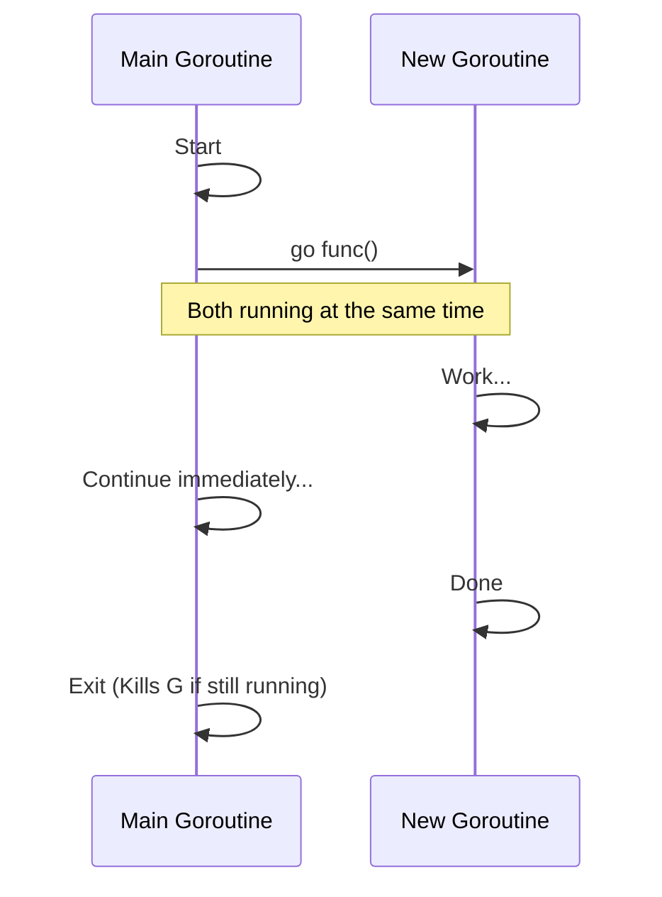

# GC.1 Goroutines: Lightweight Concurrent Execution

## Mission

Launch your first concurrent function using the `go` keyword. Understand the lifecycle of a goroutine, how it differs from a thread, and why the "Main Goroutine" is the master of all.

## Prerequisites

- `GC.0` why-concurrency-exists

## Mental Model

Think of a Goroutine as **A Kitchen Worker**.

1. **Sequential**: The Head Chef does everything. Bakes the bread, then grills the steak, then makes the salad. Total time is the SUM of all tasks.
2. **Goroutine (`go`)**: The Head Chef says "GO make the salad" to a worker. The worker starts immediately. The Head Chef **DOES NOT WAIT**. They immediately start grilling the steak themselves.

**CRITICAL RULE**: If the Head Chef leaves the kitchen (the `main` function exits), all workers must leave immediately, even if they aren't finished!

## Visual Model



## Machine View

- **Stack Size**: A goroutine starts with only **~2KB** of stack space (compared to 1-8MB for a typical OS thread). This is why you can run 1,000,000 goroutines but not 1,000,000 threads.
- **M:N Scheduler**: Go's runtime multiplexes $M$ goroutines onto $N$ OS threads. The CPU stays busy even if many goroutines are blocked on I/O.
- **Context Switching**: Switching between goroutines is much faster than switching between OS threads because it happens in "User Space" (inside the Go runtime) rather than "Kernel Space."

## Run Instructions

```bash
go run ./07-concurrency/01-concurrency/goroutines/1-goroutine
```

## Code Walkthrough

### The `go` Keyword
Adding `go` before a function call tells Go to run that function in a new, independent goroutine. The caller does not wait for it to return.

### The Closure Bug
Notice line 120: `go func(name string, prepTime time.Duration)`. We pass the loop variables as **parameters**. If we didn't, all goroutines would accidentally share the same variable and likely all try to cook the *last* dish in the list!

### `sync.WaitGroup`
Because the main goroutine finishes its loop instantly, we use a `WaitGroup` to tell the main goroutine: "Wait until these 4 workers are done before you close the kitchen."

## Try It

1. Comment out `wg.Wait()`. What happens when you run the program? (Hint: The kitchen closes before any food is made).
2. Change the number of dishes to 100. Notice how the total time stays roughly equal to the single slowest dish.
3. Remove the parameters from the anonymous function and use the loop variables directly. Run it multiple times and see if you get "Chocolate Cake" four times.

## Verification Surface

Observe that multiple orders start and finish in overlapping time:

```text
Kitchen is open! Starting all orders concurrently...

  🍳 Started preparing: Caesar Salad
  🍳 Started preparing: Grilled Steak
  🍳 Started preparing: Mushroom Pasta
  🍳 Started preparing: Chocolate Cake
  ✅ Finished: Caesar Salad (took 500ms)
  ...
  🎉 All orders complete! Total time: ~800ms
```

## In Production
**Do not use `time.Sleep` to wait for goroutines.** It is flaky and slow. Always use `sync.WaitGroup` for a known number of tasks, or **Channels** (which we will learn next) for streaming coordination.

## Thinking Questions
1. Why does Go start with a small stack and grow it dynamically?
2. What happens if a goroutine runs forever (an infinite loop) and the main function exits?
3. How many goroutines can your computer handle before it runs out of memory? (Try to find out!)

## Next Step

Next: `GC.2` -> `07-concurrency/01-concurrency/goroutines/2-wait-group`

Open `07-concurrency/01-concurrency/goroutines/2-wait-group/README.md` to continue.
