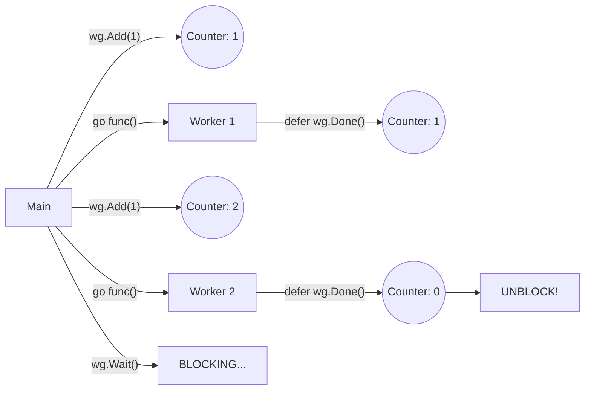

# GC.2 WaitGroups: Coordinating Completion

## Mission

Master the `sync.WaitGroup` to coordinate the termination of multiple goroutines. Learn the "Add-Done-Wait" pattern and how to avoid common pitfalls like deadlocks and race conditions.

## Prerequisites

- `GC.1` goroutines

## Mental Model

Think of a WaitGroup as **The Boarding Gate Counter**.

1. **`Add(1)`**: A passenger enters the gate area. We increment the counter.
2. **`Done()`**: A passenger walks through the jet bridge. We decrement the counter.
3. **`Wait()`**: The gate agent blocks the door to the plane until the counter hits zero. Only then can the plane take off (the main program continues).

## Visual Model



## Machine View

A `sync.WaitGroup` is essentially a **Thread-Safe Counter**.
- It uses internal `atomic` operations to ensure that multiple goroutines can call `Done()` simultaneously without corrupting the counter.
- If the counter goes below zero, it **panics** (usually caused by calling `Done()` too many times).
- If `Wait()` is called and the counter never reaches zero, the program **deadlocks** (Go's runtime will detect this and crash if no other goroutines are running).

## Run Instructions

```bash
go run ./07-concurrency/01-concurrency/goroutines/2-wait-group
```

## Code Walkthrough

### The 3-Step Pattern
1. **`wg.Add(n)`**: Called **BEFORE** the `go` keyword starts. This ensures the counter is incremented before the main goroutine has a chance to call `Wait()`.
2. **`defer wg.Done()`**: Called inside the goroutine, usually as a `defer` to ensure it runs even if the function panics or returns early.
3. **`wg.Wait()`**: Called by the coordinator (usually the main goroutine) to block until the work is done.

### Passing by Pointer
Notice line 55: `func checkService(..., wg *sync.WaitGroup, ...)`.
**CRITICAL**: You must pass a WaitGroup by **pointer**. If you pass it by value, Go makes a copy. The goroutine calls `Done()` on the copy, but the main goroutine is still waiting on the original counter, leading to a permanent **deadlock**.

## Try It

1. Change `wg *sync.WaitGroup` to `wg sync.WaitGroup` (pass by value). Run the code. Observe the "all goroutines are asleep - deadlock!" error.
2. Move `wg.Add(1)` to the first line *inside* the `checkService` function. Why is this a race condition? (Hint: The main loop might finish and call `Wait()` before any of the goroutines actually start and call `Add()`).
3. Forget to call `close(results)`. What happens to the `range results` loop?

## Verification Surface

You should see multiple health checks running concurrently and the results being gathered safely:

```text
[RUN] Health checking 6 services concurrently...

  [OK] postgres-db          latency: 124ms
  [WARN] redis-cache        latency: 210ms
  ...
[WARN] Some services are degraded - check logs!
```

## In Production
**WaitGroup is for "Fork-Join" patterns.**
Use it when you know how many tasks you are starting and you just need to wait for them to finish. If you need to stream data back continuously, or handle complex cancellations, you should use **Channels** or **Context**.

## Thinking Questions
1. Why does Go panic if the WaitGroup counter becomes negative?
2. Can you reuse a WaitGroup after `Wait()` has returned? (Yes, but be careful of the order!)
3. What is the difference between a `WaitGroup` and a `Mutex`?

## Next Step

We've mastered waiting. Now let's learn how to talk. Continue to [GC.3 Unbuffered Channels](../3-channels/README.md).
