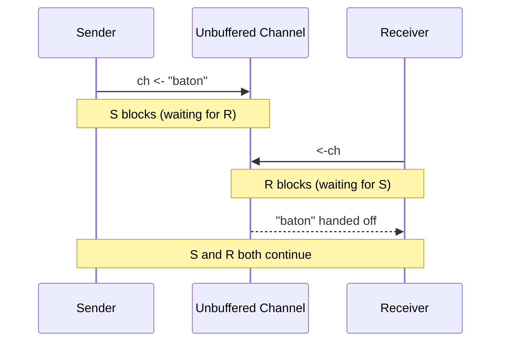

# GC.3 Unbuffered Channels: Safe Communication

## Mission

Master Go's primary tool for coordination: **Channels**. Learn the axiom "Share memory by communicating," understand how unbuffered channels synchronize goroutines, and implement your first concurrent result collector.

## Prerequisites

- `GC.2` WaitGroups

## Mental Model

Think of an Unbuffered Channel as **A Direct Hand-off**.

1. **Sender (`ch <- value`)**: You are holding a relay baton. You reach out your hand to pass it. You **cannot move** until someone else grabs it.
2. **Receiver (`value := <-ch`)**: You have your hand behind your back, waiting for the baton. You **cannot move** until the sender places the baton in your hand.
3. **Synchronization**: The exact moment the baton changes hands is a point of synchronization. Both parties are now at the same point in time.

## Visual Model



## Machine View

In Go's runtime, a channel is a `hchan` struct. An unbuffered channel has a buffer size of 0.
- When a sender arrives first, it is added to a **Send Queue** (`sendq`) and its goroutine is parked (blocked).
- When a receiver arrives first, it is added to a **Receive Queue** (`recvq`) and parked.
- When the second party arrives, the scheduler performs a direct memory copy from the sender's stack to the receiver's stack and unparks both goroutines. This is highly efficient.

## Run Instructions

```bash
go run ./07-concurrency/01-concurrency/goroutines/3-channels
```

## Code Walkthrough

### Sending and Receiving
`ch <- val` sends a value into the pipe. `<-ch` pulls it out. Both operations are blocking on an unbuffered channel.

### Concurrent Result Collection
Instead of using a `WaitGroup` and a shared slice (which would require a Mutex), we launch goroutines that each send their result into a single channel. The main goroutine simply loops and pulls results out one by one.

### The "Done" Pattern
Using `make(chan struct{})` is a common way to signal that a task is finished. Sending a value or closing the channel unblocks the waiter. `struct{}` is used because it occupies **zero bytes** of memory.

## Try It

1. Comment out the receiver (`msg := <-greetings`). Run the code. Why does it deadlock? (Hint: The sender is waiting forever for a receiver that never arrives).
2. Change the number of ports being scanned. Notice how the main loop `for i := 0; i < len(portsToScan)` ensures we wait for every single result.
3. Try sending two values into `greetings` in the goroutine, but only receive one in `main`. What happens?

## Verification Surface

Observe the concurrent port scanning results being printed as they arrive:

```text
=== Channels: Communication Between Goroutines ===

--- Basic Channel ---
  Received: Hello from a goroutine!

--- Port Scanner ---
  Scanning 10.0.1.42 on 6 ports...

  10.0.1.42:80 -> [OPEN]
  10.0.1.42:22 -> [OPEN]
  10.0.1.42:3306 -> [closed]
  ...
```

## In Production
**Unbuffered channels are for synchronization.**
They ensure that the sender and receiver meet. However, they can lead to bottlenecks if the receiver is slow. If you need to "fire and forget" or provide a temporary buffer for bursts of data, use a **Buffered Channel**.

## Thinking Questions
1. Why is it better to "share memory by communicating" instead of "communicating by sharing memory"?
2. What is the difference between a channel and a queue?
3. What happens if you try to send a value to a closed channel?

## Next Step

Next: `GC.4` -> `07-concurrency/01-concurrency/goroutines/4-channels-buffered`

Open `07-concurrency/01-concurrency/goroutines/4-channels-buffered/README.md` to continue.
