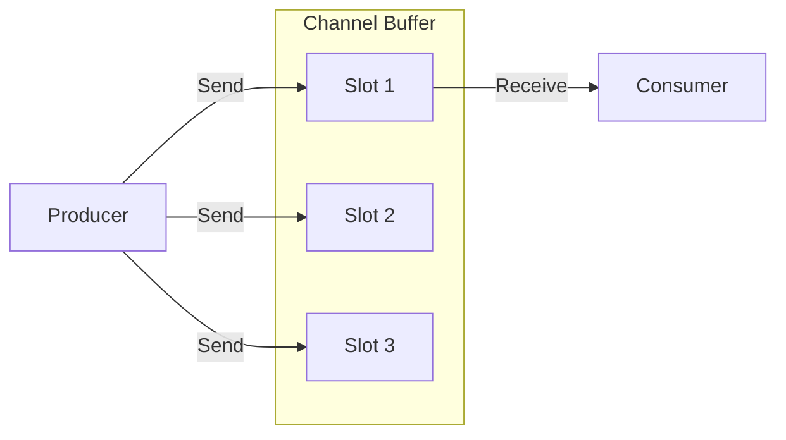

# GC.4 Buffered Channels: Bounded Asynchronous Flow

## Mission

Understand how buffered channels provide "slack" in a concurrent system. Learn to decouple producers from consumers, manage bursts of data, and recognize the trade-offs of using buffers versus direct synchronization.

## Prerequisites

- `GC.3` unbuffered-channels

## Mental Model

Think of a Buffered Channel as **A Loading Dock**.

1. **Unbuffered (The Hand-off)**: A truck (sender) can only unload if a forklift (receiver) is waiting right there to take the pallet.
2. **Buffered (The Dock)**: The truck can drop off pallets on the dock (the buffer) and leave immediately, even if the forklift hasn't arrived yet.
3. **Capacity**: If the dock is full, the next truck **must wait** until a forklift removes at least one pallet.

## Visual Model



## Machine View

A buffered channel uses a **Circular Buffer** (ring buffer) in memory.
- `make(chan T, 10)` allocates space for 10 elements of type `T` on the heap.
- `len(ch)` returns the number of items currently in the buffer.
- `cap(ch)` returns the total capacity.
- **Performance**: Buffered channels reduce "Lock Contention" between goroutines because they don't have to synchronize on every single hand-off. However, they use more memory.

## Run Instructions

```bash
go run ./07-concurrency/01-concurrency/goroutines/4-channels-buffered
```

## Code Walkthrough

### `make(chan T, N)`
The second argument sets the capacity. Without it, the capacity is 0 (unbuffered).

### Non-Blocking Sends
In the first example, we send 3 events to a channel of capacity 3. These sends happen **instantly** without a receiver being ready.

### Decoupling
In the Producer-Consumer example, the producer can finish its first 5 jobs without waiting for the consumer. This "burst" handling is the primary reason to use buffers in production.

## Try It

1. Change the buffer capacity from 3 to 1 in the first example. What happens when you try to send the 2nd event? (Hint: Deadlock, because `main` is now blocked on a send with no one to receive).
2. Increase the consumer sleep time to `1 second`. Watch how the producer fills the buffer and then is forced to slow down to the consumer's speed.
3. Use `len(events)` inside a loop to see the buffer draining in real-time.

## Verification Surface

Observe how the producer can stay "ahead" of the consumer until the buffer is full:

```text
=== Buffered Channels ===

  Buffer: 3/3 items

  1) Basic buffered channel:
     [INFO] Server started on :8080
     ...

  2) Producer-consumer pattern:
     -> Producing job #1
     -> Producing job #2
     ...
     -> Producing job #5
     -> Processing job #1  (Consumer starts after producer filled the buffer)
     ...
```

## In Production
**Do not use massive buffers to hide latency.**
A buffer of size 10,000 might prevent your producer from blocking, but it just delays the inevitable. If your consumer is slower than your producer, the buffer will *always* fill up eventually. Small buffers (1-100) are usually best for smoothing out jitter.

## Thinking Questions
1. When would you prefer an unbuffered channel over a buffered one?
2. Why can't you change the capacity of a channel after it's created?
3. What happens if the producer crashes while the buffer still has items in it?

## Next Step

Next: `GC.5` -> `07-concurrency/01-concurrency/goroutines/5-channels-closing`

Open `07-concurrency/01-concurrency/goroutines/5-channels-closing/README.md` to continue.
