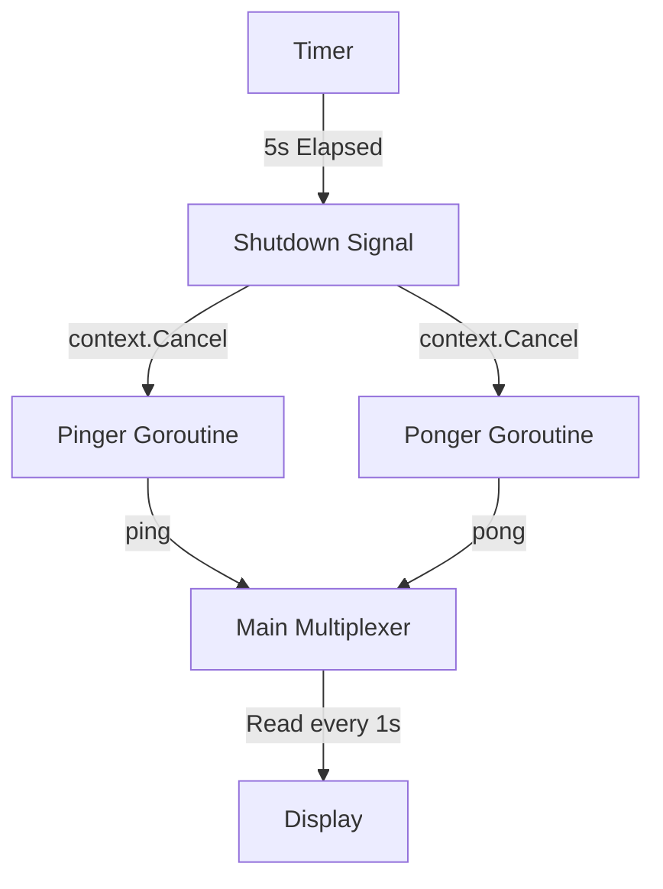

# GC.6 Concurrency Project: The Multiplexer

## Mission

Build a multi-actor system that coordinates work between several goroutines, handles time-based timeouts, and performs a graceful shutdown using `context`.

## Prerequisites

- `GC.0` through `GC.5`

## Mental Model

Think of this project as **A Live Radio Show**.

1. **The Guests (`ping` and `pong`)**: They are waiting in their rooms (goroutines) to speak.
2. **The Host (`main`)**: The host decides who speaks when.
3. **The Microphones (`channels`)**: Only one guest can speak into the microphone at a time.
4. **The Producer (`timeout`)**: After 5 minutes, the producer signals the host to end the show and turn off the power (shutdown).

## Visual Model



## Machine View

This project demonstrates the **"Fan-In" Pattern**.
- Multiple producers (`ping` and `pong`) are sending data to the same unbuffered channel.
- The main goroutine acts as the consumer, multiplexing between the data channel and a timer channel using `select`.
- **Graceful Shutdown**: By using `context.WithCancel`, we ensure that the background goroutines exit the moment we are done. Without this, the pinger/ponger would leak and stay in memory forever until the entire process dies.

## Run Instructions

```bash
go run ./07-concurrency/01-concurrency/goroutines/6-project-1
```

## Code Walkthrough

### The `select` Statement
The `select` block in `ping` and `pong` allows them to "listen" for two things at once: a signal to stop (`ctx.Done()`) or a chance to speak (`ch <- ...`).

### Throttling
We use `time.Sleep(1 * time.Second)` inside the actors to prevent them from flooding the console. This simulates real, slow work.

### Context Cancellation
`ctx, cancel := context.WithCancel(context.Background())` is the modern Go way to coordinate shutdown. Calling `cancel()` closes the `ctx.Done()` channel, which all workers are listening to.

## Try It

1. Change the timeout from 5 seconds to 2 seconds.
2. Add a third actor called `thud` that sends a message every 500ms.
3. Remove the `ctx.Done()` case from the `ping` function. Notice how the program still exits (because the main goroutine finishes), but in a real long-running server, this would be a **Goroutine Leak**.

## Verification Surface

You should see interleaved "ping" and "pong" messages for 5 seconds, followed by a clean exit:

```text
=== Concurrency Project: The Multiplexer ===

ping: 2026-04-28 21:14:38...
pong: 2026-04-28 21:14:39...
...
operation completed
done
```

## In Production
**Always have a shutdown plan.**
Never start a goroutine in a production service without knowing exactly how it will exit. Whether it's via a `Done` channel, a `Context`, or a limited number of items, "leaked" goroutines are the #1 cause of memory growth in Go applications.

## Thinking Questions
1. Why did we use one channel for both `ping` and `pong` instead of two separate ones?
2. What would happen if we didn't use `time.Sleep` in the pinger?
3. How does `context` allow us to shut down a deep "tree" of 1,000 goroutines with one function call?

## Next Step

We've built a simple coordinator. Now let's build something useful: a concurrent file downloader. Continue to [GC.7 Concurrent Downloader](../7-downloader/README.md).
