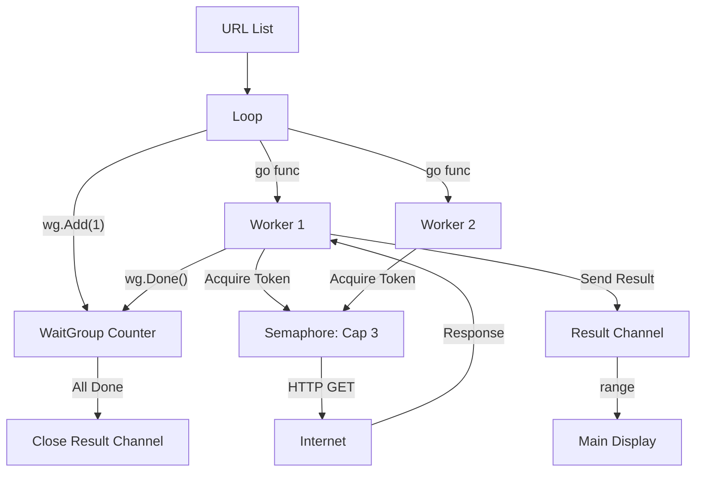

# GC.7 Concurrent Downloader: Real-World Coordination

## Mission

Build a high-performance file downloader that leverages goroutines to fetch multiple files simultaneously. Learn to coordinate results, implement a **Semaphore Pattern** for rate limiting, and avoid deadlocks using a background waiter.

## Prerequisites

- `GC.6` The Multiplexer

## Mental Model

Think of this project as **A Fleet of Delivery Vans**.

1. **The Warehouse (`urls`)**: A list of items to be picked up.
2. **The Vans (`goroutines`)**: We can send a van for every item.
3. **The Loading Bays (`semaphore`)**: The local depot only has 3 loading bays. If 10 vans want to leave, only 3 can be at the bay at once. Others must wait in line.
4. **The Manifest (`results`)**: Each van sends a report back to the central office (main goroutine) when it finishes.

## Visual Model



## Machine View

This project implements a **Bounded Worker Pattern**.
- **Semaphore**: `make(chan struct{}, 3)` acts as a lock. Since it's buffered, up to 3 goroutines can "acquire" a token by sending to it. The 4th goroutine will block on the send, preventing too many simultaneous network connections.
- **Background Waiter**: `go func() { wg.Wait(); close(results) }()` is essential. If we called `wg.Wait()` on the main thread, it would block before we started reading from `results`. This would cause all workers to block indefinitely (Deadlock) because the `results` channel is unbuffered.

## Run Instructions

```bash
go run ./07-concurrency/01-concurrency/goroutines/7-downloader
```

## Solution Walkthrough

- **The Result Struct**: We group success and error data into a single `Result` struct. This allows the main goroutine to handle errors gracefully without crashing the whole program.
- **Throttling (The Semaphore)**: `limiter <- struct{}{}` blocks if the buffer is full. `defer func() { <-limiter }()` ensures the token is returned to the buffer even if the download fails, allowing the next worker to start.
- **The Channel Range Loop**: The main goroutine uses `for result := range results` to consume and display data as it arrives. This is much more memory-efficient than waiting for all downloads to finish and returning a giant slice.


## Try It

1. Change `maxConcurrent` to `1`. Notice how the behavior becomes sequential.
2. Add a broken URL to the list. Observe how the program reports the error but continues to download the other files.
3. Remove the background waiter (`go func() { wg.Wait()... }`) and call `wg.Wait()` directly in `main`. Watch the program deadlock.

## Verification Surface

Verify that downloads happen concurrently (the total time should be much less than the sum of individual times):

```text
Downloading https://go.dev/...
Downloaded go-logo-white.svg (3657 bytes) in 150ms
...
All downloads completed in 400ms, Total: 1004567 bytes
Done
```

## In Production
**Respect external rate limits.**
Just because Go can launch 1,000,000 goroutines doesn't mean the website you are downloading from can handle 1,000,000 requests. Always use a semaphore or worker pool to bound your concurrency to a reasonable number (typically 5-50 for external APIs).

## Thinking Questions
1. Why is an unbuffered channel plus a background waiter better than a large buffered channel here?
2. What happens if one download takes 10 minutes and the others take 1 second?
3. How would you modify this to support a "Total Progress" percentage bar?

## Next Step

We've focused on coordination. Now let's learn about the dark side of concurrency: **Race Conditions**. Continue to [GC.8 Race Conditions](../8-race/README.md).
