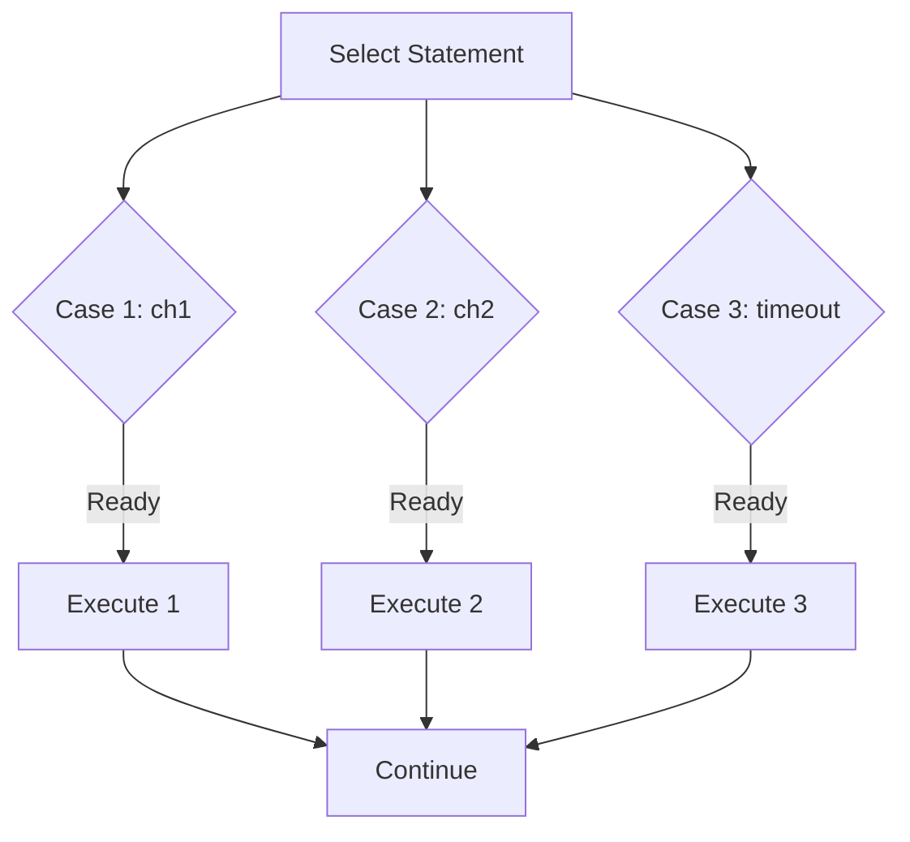

# GC.9 Select Deep Dive: The Concurrency Multiplexer

## Mission

Master the `select` statement-Go's powerful control structure for coordinating multiple channels. Learn to handle timeouts, non-blocking operations, and combine multiple data streams into one using the Fan-In pattern.

## Prerequisites

- `GC.3` through `GC.8`

## Mental Model

Think of `select` as **An Air Traffic Controller**.

1. **The Planes**: Each channel is a plane waiting for a runway.
2. **The Logic**: `select` looks at all runways at once. If Runway A has a plane ready to land (receive) or take off (send), it clears it immediately.
3. **The Tie-breaker**: If two planes are ready at the same time, the controller picks one **randomly** to ensure fairness and prevent starvation.
4. **The "Wait"**: If no planes are ready, the controller sits and waits-unless there is a `default` instruction to do something else (non-blocking).

## Visual Model



## Machine View

The `select` statement is implemented as a runtime function (`selectgo`).
1. **Scaffolding**: It randomizes the order of cases to avoid bias.
2. **Polling**: it checks all channels to see if any are ready (have data in buffer or a blocked waiter).
3. **Blocking**: If none are ready, it adds the current goroutine to the `recvq`/`sendq` of **every** channel in the `select` block and parks it.
4. **Wakeup**: The first channel that becomes ready unparks the goroutine and removes it from all other channel queues.

## Run Instructions

```bash
go run ./07-concurrency/01-concurrency/goroutines/9-select-deep-dive
```

## Code Walkthrough

### Timeout Pattern
`case <-time.After(d)` is the most common way to prevent your program from hanging forever on a slow external dependency.

### Non-blocking Select
By adding a `default` case, `select` becomes non-blocking. This is useful for polling or for trying to send a notification without stopping progress.

### Context Cancellation
`case <-ctx.Done()` is the professional way to handle timeouts and manual cancellations in production Go services.

### Fan-In Pattern
We launch multiple goroutines and funnel their results into a single output channel. This allows a consumer to read from many sources as if they were one.

## Try It

1. In `basicSelect`, change the sleep times to be equal. Run the code 5 times. Notice how the order of "Received from channel 1" and "2" changes randomly.
2. Remove the `default` case from `nonBlockingSelect`. Watch the program deadlock.
3. Increase the timeout in `contextCancellation` so that the work has time to complete.

## Verification Surface

Observe the different patterns in action, especially the random interleaving of producers in the Fan-In section:

```text
=== Select Statement Deep Dive ===

--- 1. Basic Select ---
  Received: from channel 1
  Received: from channel 2

--- 2. Timeout Pattern ---
  ⏰ Operation timed out after 500ms

--- 5. Fan-In Pattern ---
  Producer 0: message 0
  Producer 2: message 0
  Producer 1: message 0
  ...
```

## In Production
**Beware of the "Zero-Case" Select.**
`select {}` (with no cases) blocks forever. It is sometimes used to keep a main function alive, but it's usually a sign that you should be using a `WaitGroup` or a proper shutdown signal.

## Thinking Questions
1. Why does Go randomize the order of cases in a `select` statement?
2. What is the difference between `time.After(d)` inside a loop versus outside a loop? (Hint: Memory leaks!)
3. How can you use `select` to implement a "Priority Queue" where one channel is checked more often than another?

## Next Step

We've covered Goroutines and Channels extensively. Now let's explore the lower-level synchronization primitives that power high-performance Go code. Continue to [GC.10 Sync Primitives](../10-sync-primitives/README.md).
