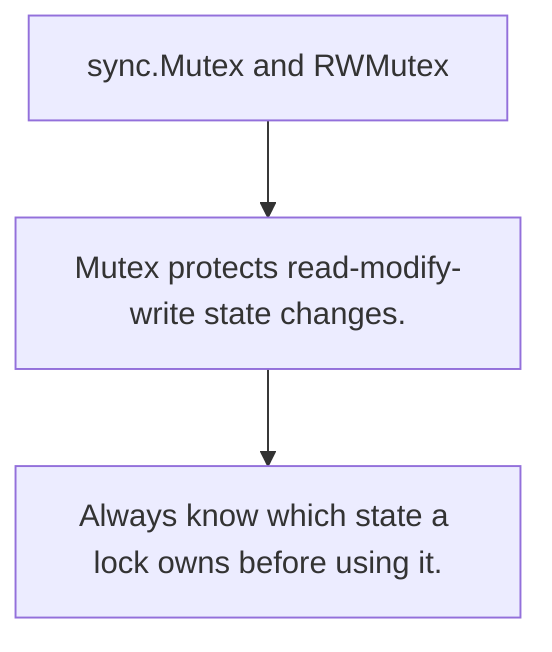

# SY.1 sync.Mutex and RWMutex

## Mission

Learn how mutual exclusion protects shared state and when read/write locks are worth the extra rules.

## Prerequisites

- none

## Mental Model

A mutex gives one goroutine exclusive access to shared state for a short critical section.

## Visual Model



## Machine View

Locking serializes access because shared memory updates are not automatically safe or atomic.

## Run Instructions

```bash
go run ./07-concurrency/01-concurrency/sync-primitives/1-mutex-and-rwmutex
```

## Code Walkthrough

### Mutex protects read-modify-write state changes.

Mutex protects read-modify-write state changes.

### RWMutex only helps when many readers and few writers e

RWMutex only helps when many readers and few writers exist.

### Always know which state a lock owns before using it.

Always know which state a lock owns before using it.

## Try It

1. Change one of the example inputs and rerun the lesson.
2. Explain which boundary the lesson is trying to make explicit.
3. Describe how you would apply SY.1 in a small service or tool.

## ⚠️ In Production

Use locks to protect ownership, not to hide unclear data flow. The safest critical sections stay small and obvious.

## 🤔 Thinking Questions

1. What problem does this topic solve?
2. What breaks if this boundary is handled implicitly instead of explicitly?
3. Where would you expect to use this topic in production Go code?

## Next Step

Continue to `SY.2`.
