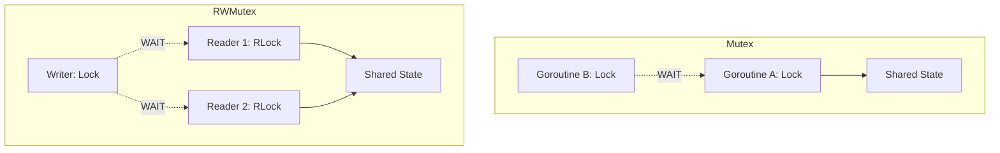

# SY.1 Mutex & RWMutex: Guarding the State

## Mission

Master the two most fundamental synchronization primitives in Go: `sync.Mutex` and `sync.RWMutex`. Learn how to create "Critical Sections" that prevent race conditions and understand when to use Read-Write locks for performance optimization.

## Prerequisites

- `GC.7` concurrent-downloader

## Mental Model

### 1. `sync.Mutex` (The Bathroom Lock)
Think of a Mutex as a **Single-Occupancy Bathroom**.
- If one person is inside (Lock), everyone else must wait in line.
- It doesn't matter if you are there to wash your hands or take a shower; only one person can enter at a time.

### 2. `sync.RWMutex` (The Museum Gallery)
Think of an RWMutex as a **Museum Gallery**.
- **RLock**: 100 people can enter to look at the paintings at the same time. They aren't changing anything.
- **Lock**: If an artist needs to paint over a mural, **everyone** must leave. No one can be looking while the mural is being changed.

## Visual Model



## Machine View

- **Mutex**: Is a structure containing an integer state and a semaphore. When you call `Lock()`, it tries to atomically set the state. If it fails (already locked), it notifies the OS to sleep the thread (parking).
- **RWMutex**: Is more complex. it tracks the number of active readers. A writer must wait for the reader count to reach zero. While a writer is waiting, **new readers are also blocked** to prevent the writer from starving (Writer Preference).

## Run Instructions

```bash
go run ./07-concurrency/01-concurrency/sync-primitives/1-mutex-and-rwmutex
```

## Code Walkthrough

### `sync.Mutex` in BankAccount
We use a simple `mu.Lock()`/`mu.Unlock()` pattern. By using `defer mu.Unlock()`, we ensure the lock is released even if the function panics, preventing a permanent deadlock.

### `sync.RWMutex` in ConfigCache
Notice `mu.RLock()` in the `Get` method. This allows many goroutines to read the configuration simultaneously. If we used a regular `Mutex`, each read would block every other read, slowing down the system for no reason.

### Critical Sections
Keep them as small as possible. Only hold the lock for the exact lines that touch the shared state. Don't perform network calls or heavy processing while holding a lock!

## Try It

1. Change `Deposit` to not use the mutex. Run it with `go run -race`. Observe the data race warning.
2. Replace `RLock` with `Lock` in the `ConfigCache`. Notice how the total execution time increases because readers are now serializing.
3. Try to call `Lock()` twice in the same goroutine. What happens? (Hint: Fatal error: deadlock).

## Verification Surface

Observe that the Bank Account balance is perfectly accurate (1100) even with 1,000 concurrent deposits:

```text
=== SY.1 Mutex & RWMutex ===

Scenario 1: Concurrent Deposits (sync.Mutex)
  Final Balance: 1100 (Expected: 1100)

Scenario 2: Read-Heavy Workload (sync.RWMutex)
  [Writer] Theme updated to light
  Final Theme: light
```

## In Production
**Locks are for shared state ownership.**
If you find yourself passing locks between packages or holding them for long periods, your architecture is likely too coupled. Prefer "Ownership" patterns (where only one goroutine ever touches the data) over shared-memory locks whenever possible.

## Thinking Questions
1. Why is `defer mu.Unlock()` considered a best practice even if it's slightly slower than a manual call?
2. What happens if you call `Unlock()` on a mutex that isn't locked?
3. When does an `RWMutex` actually become slower than a regular `Mutex`? (Hint: Read/Write ratio).

## Next Step

Next: `SY.2` -> `07-concurrency/01-concurrency/sync-primitives/2-once-and-sync-map`

Open `07-concurrency/01-concurrency/sync-primitives/2-once-and-sync-map/README.md` to continue.
