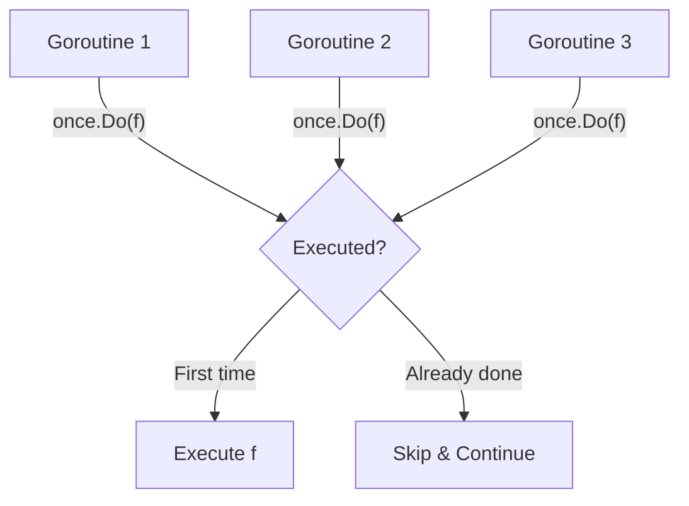

# SY.2 Sync Primitives: Once and Map

## Mission

Master the specialized synchronization primitives in Go's `sync` package. Learn to implement thread-safe Singletons using `sync.Once` and understand when (and when not) to use `sync.Map` for high-concurrency data storage.

## Prerequisites

- `SY.1` Mutex and RWMutex

## Mental Model

### 1. `sync.Once` (The Vow)
Think of `sync.Once` as **A Wedding Vow**. No matter how many times you are asked later, the "I do" only happens once. Even if 100 people shout "I do" at the exact same microsecond, the official ceremony logic only executes once.

### 2. `sync.Map` (The Specialized Cabinet)
Think of `sync.Map` as **A Special Library Archive**.
- It is optimized for situations where people are reading the same books over and over, and new books are rarely added.
- If you were constantly adding thousands of new books every second, the library's specialized indexing would actually slow everyone down compared to a standard bookshelf with a simple lock.

## Visual Model



## Machine View

- **`sync.Once`**: Uses a `done` flag and a `Mutex`. The first goroutine to arrive locks the mutex, checks the flag, runs the function, sets the flag to 1, and unlocks. Subsequent goroutines use `atomic.LoadUint32` to check the flag-which is extremely fast-and skip the lock entirely.
- **`sync.Map`**: Uses two internal maps: `read` (atomic, lock-free) and `dirty` (requires a mutex).
    - It is **optimized for read-heavy workloads** with keys that are already present.
    - It performs poorly if you are constantly adding new keys (which forces it to lock the `dirty` map).
    - For 90% of Go applications, a regular `map` + `sync.RWMutex` is faster and more flexible.

## Run Instructions

```bash
go run ./07-concurrency/01-concurrency/goroutines/10-sync-primitives
```

## Code Walkthrough

### `sync.Once`
The `once.Do(func)` pattern is the idiomatic way to handle "Lazy Initialization." It guarantees that the function has finished executing before any caller returns, preventing any "half-initialized" state.

### `sync.Map`
`Load`, `Store`, and `LoadOrStore` are the primary methods. Note that `LoadOrStore` is atomic-it's the only way to "Get if exists, else Set" without a race condition on a shared map.

### Map + RWMutex
This is the "Control" example. We show how to wrap a regular map with a `sync.RWMutex`. This is the preferred pattern for general-purpose thread-safe maps in Go.

## Try It

1. Try to initialize the database twice by calling `dbOnce.Do` again in another part of the code. Observe that the second call is ignored.
2. In the `sync.Map` section, use `m.Delete("key-0")` and then try to load it.
3. Compare the performance: launch 1,000,000 reads on a `sync.Map` vs a `map + RWMutex`. Which one is faster?

## Verification Surface

Verify that the database initialization only happens once despite multiple goroutines calling it:

```text
=== sync.Once Demo ===
  Initializing database connection (only once!)
  Goroutine 0: got DB at localhost:5432
  Goroutine 1: got DB at localhost:5432
  ...

=== sync.Map Demo ===
  Stored: key-0 = 0
  ...
Loading values:
  key-0 = 0
```

## In Production
**Don't use `sync.Map` by default.**
The Go team specifically warns that `sync.Map` is only for very narrow use cases (stable keys, disjoint writes). For almost every other case, a regular map protected by a `sync.RWMutex` or `sync.Mutex` is easier to reason about and often faster due to lower overhead.

## Thinking Questions
1. Why does `sync.Once` use a `Mutex` internally if it's supposed to be fast?
2. What happens if the function passed to `once.Do` panics? (Hint: The flag is still set!)
3. Why is `sync.Map`'s `Range` method less efficient than a regular map loop?

## Next Step

Next: `SY.3` -> `07-concurrency/01-concurrency/sync-primitives/3-atomic-operations`

Open `07-concurrency/01-concurrency/sync-primitives/3-atomic-operations/README.md` to continue.
