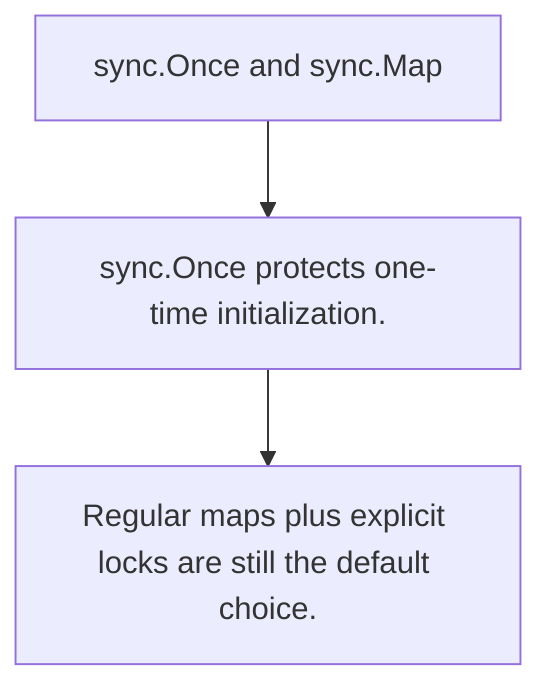

# SY.2 sync.Once and sync.Map

## Mission

Learn the standard-library helpers for one-time initialization and specific concurrent map workloads.

## Prerequisites

- SY.1

## Mental Model

Once is a one-shot gate. sync.Map is a specialized concurrent map, not a universal replacement for map plus mutex.

## Visual Model



## Machine View

Both types encode concurrency patterns into library primitives so callers do not rewrite the same coordination logic badly.

## Run Instructions

```bash
go run ./07-concurrency/01-concurrency/sync-primitives/2-once-and-sync-map
```

## Code Walkthrough

### sync.Once protects one-time initialization.

sync.Once protects one-time initialization.

### sync.Map is useful for read-heavy or disjoint-key work

sync.Map is useful for read-heavy or disjoint-key workloads.

### Regular maps plus explicit locks are still the default

Regular maps plus explicit locks are still the default choice.

## Try It

1. Change one of the example inputs and rerun the lesson.
2. Explain which boundary the lesson is trying to make explicit.
3. Describe how you would apply SY.2 in a small service or tool.

## ⚠️ In Production

Pick these tools for the workload they are meant for; overusing them usually hides a simpler design.

## 🤔 Thinking Questions

1. What problem does this topic solve?
2. What breaks if this boundary is handled implicitly instead of explicitly?
3. Where would you expect to use this topic in production Go code?

## Next Step

Continue to `SY.3`.
