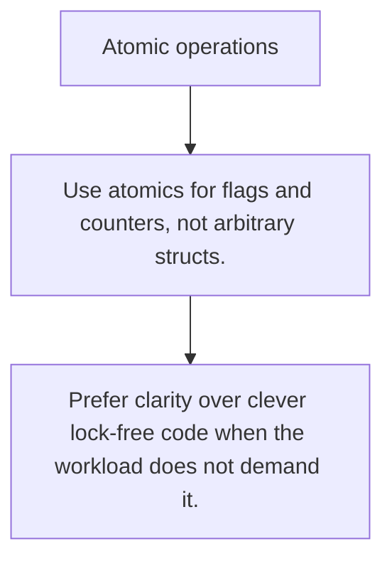

# SY.3 Atomic operations

## Mission

Learn when lock-free atomic reads and writes are the right tool for counters, flags, and single-word state.

## Prerequisites

- SY.2

## Mental Model

Atomics are for tiny pieces of shared state where the whole operation fits in one hardware-backed atomic step.

## Visual Model



## Machine View

Atomic operations avoid full mutex locking but only for state that can be updated safely in one primitive operation.

## Run Instructions

```bash
go run ./07-concurrency/01-concurrency/sync-primitives/3-atomic-operations
```

## Code Walkthrough

### Use atomics for flags and counters, not arbitrary stru

Use atomics for flags and counters, not arbitrary structs.

### Compare-and-swap coordinates changes around one curren

Compare-and-swap coordinates changes around one current value.

### Prefer clarity over clever lock-free code when the wor

Prefer clarity over clever lock-free code when the workload does not demand it.

## Try It

1. Change one of the example inputs and rerun the lesson.
2. Explain which boundary the lesson is trying to make explicit.
3. Describe how you would apply SY.3 in a small service or tool.

## ⚠️ In Production

Atomics are precise tools. If the state spans multiple fields or invariants, a mutex is usually the clearer choice.

## 🤔 Thinking Questions

1. What problem does this topic solve?
2. What breaks if this boundary is handled implicitly instead of explicitly?
3. Where would you expect to use this topic in production Go code?

## Next Step

Continue to `SY.4`.
