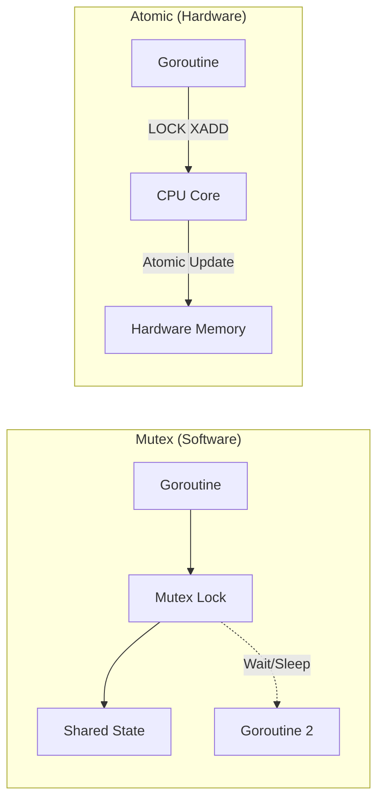

# SY.3 Atomic Operations: Hardware-Level Sync

## Mission

Master the `sync/atomic` package to perform lock-free state updates. Learn the difference between software-level Mutexes and hardware-level atomic instructions, and how to use `atomic.Value` for thread-safe configuration snapshots.

## Prerequisites

- `SY.2` sync-once-and-sync-map

## Mental Model

Think of Atomic Operations as **A High-Speed Turnstile**.

1. **Mutex (The Security Guard)**: The guard stops you, checks your ID, opens the gate, lets you through, and closes the gate. It's safe but slow.
2. **Atomic (The Mechanical Turnstile)**: The turnstile only moves in one direction. It doesn't need a guard. The hardware itself (the turnstile mechanism) ensures that only one person can push through a single slot at a time. It's incredibly fast because there is no human interaction (OS context switching).

## Visual Model



## Machine View

Atomic operations use specialized CPU instructions:
- **X86**: `LOCK XADD` or `LOCK CMPXCHG`.
- **ARM**: `LDREX` / `STREX` pairs.

These instructions tell the CPU's memory controller to "lock the bus" or "lock the cache line" for the exact duration of a single read-modify-write cycle. This prevents any other CPU core from seeing a stale value.
- **Benefits**: No "Parking." The goroutine never goes to sleep, meaning there is zero overhead from the Go scheduler or the OS.
- **Limitations**: Only works on single words (32/64 bits) or pointers. You cannot atomically increment a whole struct.

## Run Instructions

```bash
go run ./07-concurrency/01-concurrency/sync-primitives/3-atomic-operations
```

## Code Walkthrough

### `atomic.AddInt64`
This is the workhorse of metrics. We can increment `requests` and `active` counts across thousands of goroutines without the overhead of a Mutex.

### `atomic.LoadInt64`
Even reading an integer should be done atomically if it's being written to concurrently. This ensures you see a consistent 64-bit value rather than "torn" data.

### `atomic.Value`
This is a specialized wrapper that allows you to atomically `Load` and `Store` any interface value. It is perfect for configuration objects that are read frequently but updated rarely.

## Try It

1. Try to increment a regular `int` variable without using atomic and run with `-race`.
2. Use `atomic.CompareAndSwapInt64` to implement a "Check and Set" logic.
3. Compare the speed of 10,000,000 atomic increments versus 10,000,000 mutex-protected increments.

## Verification Surface

Observe that the metrics are accurate even without a Mutex:

```text
=== SY.3 Atomic Operations ===

Scenario 1: High-Frequency Counter
  Total Requests: 1000
  Active Workers: 0 (Expected: 0)

Scenario 2: Config Snapshotting
  Read 1: Initial Config
  [System] Config rotated!
  Read 2: Updated Production Config
```

## In Production
**Don't over-optimize with atomics.**
Atomics are harder to read and reason about than Mutexes. Only reach for `sync/atomic` if your profiling shows that a Mutex is a significant bottleneck (usually only in extremely high-traffic counters or low-level libraries). For business logic, **Mutex is usually better.**

## Thinking Questions
1. Why can't you use atomics on a `float64` directly?
2. What happens if two goroutines try to call `Store` on the same `atomic.Value` at once?
3. What is "Tearing" and how do atomic operations prevent it?

## Next Step

We've mastered the tools. Now let's dive deep into the most common bug that forces us to use them. Continue to [SY.4 Race Conditions](../4-race-conditions/README.md).
