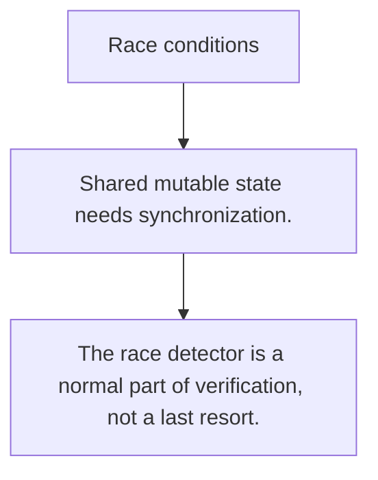

# SY.4 Race conditions

## Mission

Learn how data races happen, why the race detector matters, and how to read its reports.

## Prerequisites

- SY.3

## Mental Model

A race is unsynchronized shared access where at least one access is a write.

## Visual Model



## Machine View

Races are bugs because the runtime and CPU may interleave operations unpredictably between goroutines.

## Run Instructions

```bash
go run ./07-concurrency/01-concurrency/sync-primitives/4-race-conditions
```

## Code Walkthrough

### Shared mutable state needs synchronization.

Shared mutable state needs synchronization.

### Lost updates and stale reads come from interleaving, n

Lost updates and stale reads come from interleaving, not just from high load.

### The race detector is a normal part of verification, no

The race detector is a normal part of verification, not a last resort.

## Try It

1. Change one of the example inputs and rerun the lesson.
2. Explain which boundary the lesson is trying to make explicit.
3. Describe how you would apply SY.4 in a small service or tool.

## ⚠️ In Production

The race detector is one of the highest-value debugging tools in Go. Use it routinely before you trust concurrent code.

## 🤔 Thinking Questions

1. What problem does this topic solve?
2. What breaks if this boundary is handled implicitly instead of explicitly?
3. Where would you expect to use this topic in production Go code?

## Next Step

Continue to `SY.5`.
