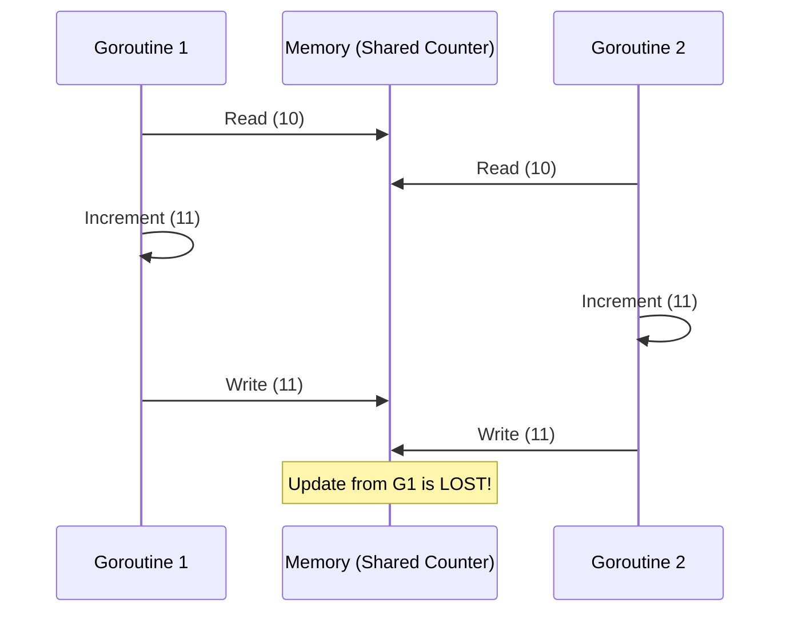

# SY.4 Race Conditions: The Dark Side

## Mission

Visualize the invisible: **Race Conditions**. Learn why concurrent access to shared data leads to corruption, how to use the Go Race Detector, and understand the basic tools for repairing synchronization bugs.

## Prerequisites

- `SY.3` atomic-operations

## Mental Model

Think of a Race Condition as **Two People Updating the Same Whiteboard**.

1. **The Goal**: Add a mark to the board. There should be 2 marks total.
2. **Person A**: Reads the board (0 marks). Turns around to pick up a pen.
3. **Person B**: Reads the board (0 marks). Turns around to pick up a pen.
4. **Person A**: Draws a mark and says "Board has 1 mark."
5. **Person B**: Draws a mark and says "Board has 1 mark."
6. **The Result**: There are 2 marks on the board, but both people think there is only 1. One update was "lost."

## Visual Model



## Machine View

At the CPU level, `counter++` is not a single instruction. It is **three** distinct operations:
1. `MOV EAX, [counter]` (Load value into register)
2. `INC EAX` (Increment register)
3. `MOV [counter], EAX` (Store register back to memory)

If the OS or the Go scheduler switches threads between step 1 and step 3, another thread can read the stale value.

**The Race Detector**: Go includes a powerful tool (`-race`) that instruments every memory access at compile time. It records the "happens-before" relationship of every access and screams if two goroutines access the same memory address without a clear lock or channel signal between them.

## Run Instructions

Run normally first:
```bash
go run ./07-concurrency/01-concurrency/goroutines/8-race
```

Then run with the **Race Detector**:
```bash
go run -race ./07-concurrency/01-concurrency/goroutines/8-race
```

## Code Walkthrough

### The `unsafeCounter`
This function launches 1,000 goroutines that all increment a shared integer. Because `counter++` is not atomic, they overwrite each other's work.

### `sync.Mutex`
We add a `mu.Lock()` and `mu.Unlock()`. This ensures that only one goroutine can be in the "Critical Section" (the increment line) at a time. All other goroutines will block at `mu.Lock()` until the current holder releases it.

### `sync/atomic`
For simple counters, a Mutex is often overkill. `atomic.AddInt64` uses special CPU instructions (like LOCK XADD on x86) to perform the read-modify-write in a single, uninterruptible hardware step.

## Try It

1. Run the code with `-race`. Read the output carefully. It will tell you exactly which lines of code are racing.
2. Remove the `mu.Unlock()` call. What happens? (Hint: Deadlock).
3. Try using `sync.RWMutex` instead of `sync.Mutex`. When would that be more efficient?

## Verification Surface

Verify that the "Unsafe" count is often less than 1000, while Mutex and Atomic are always exactly 1000:

```text
1) Unsafe (no protection):
   Run 1: count = 942 (expected 1000) ❌ RACE!
   Run 2: count = 981 (expected 1000) ❌ RACE!

2) Mutex (sync.Mutex):
   count = 1000 ✅

3) Atomic (sync/atomic):
   count = 1000 ✅
```

## In Production
**Races are often "Heisenbugs."**
They might not show up on your local machine, but they will crash your production server under high load. **Never ignore a race detector warning.** Even if the code "seems to work," a race condition is a sign of undefined behavior that will eventually lead to a crash or data corruption.

## Thinking Questions
1. Why is `atomic` faster than `mutex` for a simple counter?
2. Why can't the compiler automatically detect and fix race conditions?
3. If you have a race condition on a `map`, what happens to your Go program? (Hint: It's a fatal crash).

## Next Step

We've learned how to fix shared state. Now let's look at bugs that cause our programs to grow in memory until they crash. Continue to [SY.5 Goroutine Leaks](../5-goroutine-leaks/README.md).
