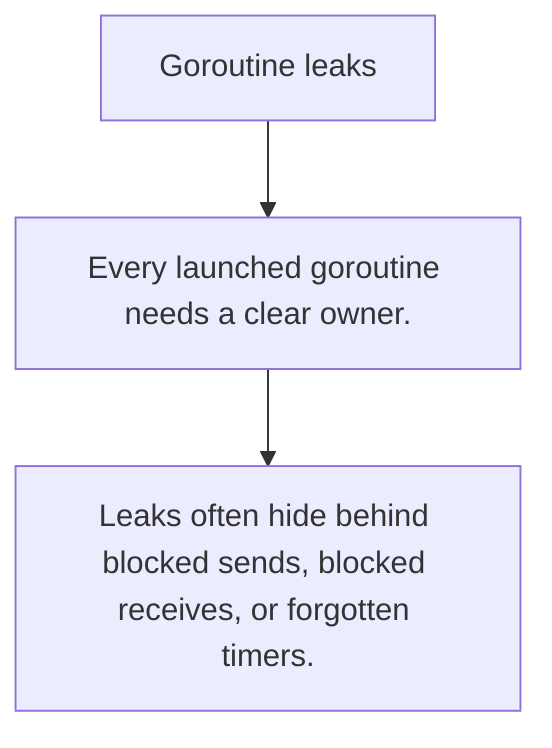

# SY.5 Goroutine leaks

## Mission

Learn how goroutines get stranded and why lifetime ownership matters as much as spawning work.

## Prerequisites

- SY.4

## Mental Model

A goroutine leak is a task that never finishes because nothing closes its channel, cancels its context, or lets it return.

## Visual Model



## Machine View

Leaked goroutines keep stacks, descriptors, timers, and downstream work alive long after the useful request or job ended.

## Run Instructions

```bash
go run ./07-concurrency/01-concurrency/sync-primitives/5-goroutine-leaks
```

## Code Walkthrough

### Every launched goroutine needs a clear owner.

Every launched goroutine needs a clear owner.

### Contexts and channel closure define lifetime boundarie

Contexts and channel closure define lifetime boundaries.

### Leaks often hide behind blocked sends, blocked receive

Leaks often hide behind blocked sends, blocked receives, or forgotten timers.

## Try It

1. Change one of the example inputs and rerun the lesson.
2. Explain which boundary the lesson is trying to make explicit.
3. Describe how you would apply SY.5 in a small service or tool.

## ⚠️ In Production

Leak prevention is mostly design discipline: every goroutine needs a stop condition that another part of the program actually controls.

## 🤔 Thinking Questions

1. What problem does this topic solve?
2. What breaks if this boundary is handled implicitly instead of explicitly?
3. Where would you expect to use this topic in production Go code?

## Next Step

Continue to `SY.6`.
