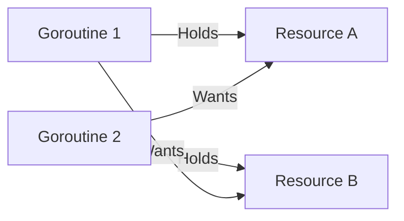

# SY.6 Deadlocks: The Frozen State

## Mission

Understand the anatomy of a **Deadlock** and learn the "Four Coffman Conditions" that cause them. Master the discipline of **Lock Ordering** and learn how to interpret Go's runtime deadlock detection.

## Prerequisites

- `SY.5` goroutine-leaks

## Mental Model

Think of a Deadlock as **Two People in a Narrow Hallway**.

1. **The Conflict**: Person A is walking East, Person B is walking West.
2. **The Standoff**: They meet in the middle. Person A won't step aside until Person B moves. Person B won't step aside until Person A moves.
3. **The Result**: Both stand there forever. Neither can make progress.

## Visual Model



## Machine View

A deadlock occurs when there is a **Circular Wait**.
1. **The Panic**: If Go's runtime scheduler detects that **all** goroutines are blocked (none are ready to run), it will crash the program with: `fatal error: all goroutines are asleep - deadlock!`.
2. **Partial Deadlocks**: If even *one* goroutine is still able to run (like a background logger or a monitoring loop), the Go runtime **cannot** detect the deadlock. Your program will simply hang silently while memory and CPU usage stay flat.

## Run Instructions

```bash
go run ./07-concurrency/01-concurrency/sync-primitives/6-deadlocks
```

## Code Walkthrough

### The Setup
We have two resources, each with its own Mutex.

### The Circular Wait
- Worker 1 locks A, then tries to lock B.
- Worker 2 locks B, then tries to lock A.
- If Worker 2 locks B *after* Worker 1 has already locked A, both workers will be blocked waiting for a lock held by the other.

### The Fix (Consistent Ordering)
The solution is simple: **Always lock in the same order.** If both workers were programmed to lock A then B, Worker 2 would simply wait at the "Lock A" step until Worker 1 was completely finished with both, and no deadlock would occur.

## Try It

1. Fix the deadlock: change Worker 2 to lock `resA` before `resB`.
2. Remove the `time.Sleep` in the workers. Does the deadlock still happen every time? (Hint: No, it becomes a "Race Condition" where it only happens sometimes).
3. Comment out the "Monitor" goroutine in `main.go`. Watch the Go runtime crash the program with a fatal error.

## Verification Surface

Observe how the two workers get stuck and the program never reaches the "Success" lines:

```text
=== SY.6 Deadlocks ===

Scenario: Circular Wait Deadlock
  [Worker 1] Locking A...
  [Worker 2] Locking B...
  [Worker 1] Trying to lock B...
  [Worker 2] Trying to lock A...
  [Main] Waiting for workers (expecting hang)...

  !!! SYSTEM DETECTED HANG !!!
```

## In Production
**Deadlocks are design failures.**
To avoid them:
- **Lock Ordering**: Document and enforce the order in which locks must be acquired.
- **Avoid Nested Locks**: Try to never hold two locks at the same time.
- **Use Channels**: Channels are much harder to deadlock than Mutexes because they naturally encourage a "Flow" of data rather than a "Gridlock" of state.

## Thinking Questions
1. Why can't the Go compiler catch deadlocks at compile time?
2. What is the difference between a Deadlock and a Livelock?
3. How can you use `select` with a timeout to "break" a potential deadlock?

## Next Step

Next: `CT.1` -> `07-concurrency/01-concurrency/context/1-background`

Open `07-concurrency/01-concurrency/context/1-background/README.md` to continue.
