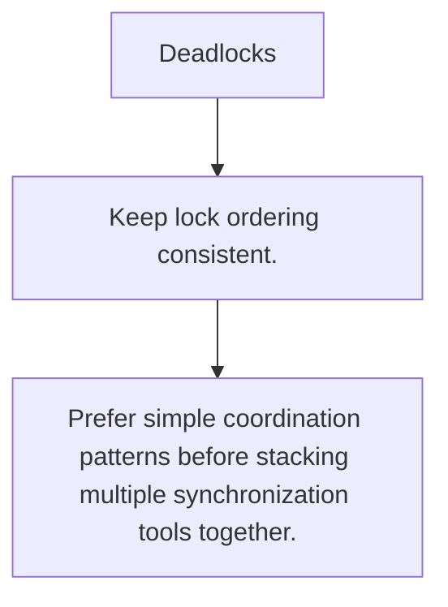

# SY.6 Deadlocks

## Mission

Learn how circular waits and unbalanced channel or lock usage can freeze a concurrent program.

## Prerequisites

- SY.5

## Mental Model

Deadlocks happen when each waiting actor needs another waiting actor to move first.

## Visual Model



## Machine View

Locks, channels, and wait groups can all deadlock when the coordination graph has no possible next step.

## Run Instructions

```bash
go run ./07-concurrency/01-concurrency/sync-primitives/6-deadlocks
```

## Code Walkthrough

### Keep lock ordering consistent.

Keep lock ordering consistent.

### Match every send with a reachable receiver and every w

Match every send with a reachable receiver and every wait with a reachable done path.

### Prefer simple coordination patterns before stacking mu

Prefer simple coordination patterns before stacking multiple synchronization tools together.

## Try It

1. Change one of the example inputs and rerun the lesson.
2. Explain which boundary the lesson is trying to make explicit.
3. Describe how you would apply SY.6 in a small service or tool.

## ⚠️ In Production

Deadlocks are design bugs. They disappear when ownership, lock ordering, and channel direction are made explicit.

## 🤔 Thinking Questions

1. What problem does this topic solve?
2. What breaks if this boundary is handled implicitly instead of explicitly?
3. Where would you expect to use this topic in production Go code?

## Next Step

Use this lesson as a reference surface before moving to the next track in the section.
