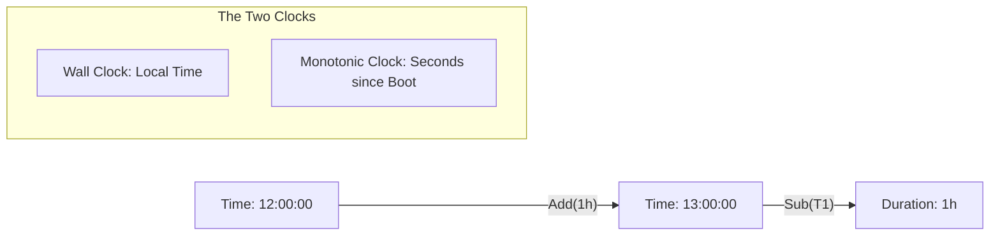

# TM.1 Time Basics: The Fourth Dimension

## Mission

Understand how Go handles the passage of time. Learn the difference between Wall clocks and Monotonic clocks, master the `time.Duration` type, and understand why `time.Sleep` is the most basic building block of concurrent synchronization.

## Prerequisites

- `CT.1` to `CT.5`

## Mental Model

Think of `time.Time` as **A GPS Coordinate for History**.

1. **The Position (`time.Time`)**: This is where you are on the timeline (e.g., "Tuesday at 4 PM").
2. **The Distance (`time.Duration`)**: This is the gap between two points (e.g., "5 minutes").
3. **The Compass (`Monotonic Clock`)**: Even if someone manually changes the time on the GPS (Wall Clock), the compass still accurately measures how far you've actually walked (Real time passed).

## Visual Model



## Machine View

A `time.Time` struct in Go is sophisticated:
- **Wall Clock**: Used for display and persistence. Subject to NTP adjustments and leap seconds.
- **Monotonic Clock**: Used for measurements. It only increases. When you subtract two times, Go uses the monotonic portion to ensure that `duration` is never negative just because the system clock was synced backward.
- **Precision**: Go handles time at **Nanosecond** precision.

## Run Instructions

```bash
go run ./07-concurrency/01-concurrency/time-and-scheduling/1-time
```

## Code Walkthrough

### `time.Now()`
Returns the current time. It contains both the wall and monotonic readings.

### `time.Duration`
In Go, durations are integers (nanoseconds). You create them by multiplying a number by a unit: `5 * time.Minute`. **Never pass a raw integer to a time function.** Always use units.

### `time.Sleep()`
Blocks the current goroutine for the specified duration. This is a "Stop the World" operation for that specific goroutine, but it doesn't affect other goroutines in your system.

### Arithmetic
- `Add(duration)`: Returns a new time in the future/past.
- `Sub(time)`: Returns a duration representing the gap between two moments.

## Try It

1. Calculate how many seconds have passed since your birthday.
2. What happens if you try to sleep for a negative duration? (Hint: It returns immediately).
3. Try to add a huge duration (e.g., 100 years). Does Go handle it? (Hint: Yes, it uses 64-bit nanoseconds).

## Verification Surface

Observe how Go handles different time calculations and the sleep operation:

```text
=== Time Basics ===

Current time: 2026-04-29 11:30:40...
Year: 2026, Month: April, Day: 29
Weekday: Wednesday

One second: 1s
1h30m as string: 1h30m0s

Time since Go launch (approx): 144168h...

Sleeping for 100 milliseconds...
Awake after sleep!
```

## In Production
**Don't use `time.Now()` for critical timing logic.**
If you are measuring how long a database query took, always use `time.Since(start)`. This is shorthand for `time.Now().Sub(start)`, and it guarantees the use of the monotonic clock. Using manual string parsing to compare times is prone to errors during Daylight Savings Time (DST) transitions.

## Thinking Questions
1. Why are durations expressed as `int64` nanoseconds instead of floats?
2. What happens to a `time.Sleep` if the OS puts the computer to sleep?
3. How does Go represent time before the Unix Epoch (1970)?

## Next Step

We've mastered the basics. Now let's learn how to present time to humans in different formats. Continue to [TM.2 Formatting](../2-formatting/README.md).
