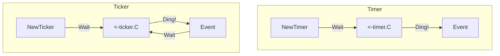

# TM.3 Timers & Tickers: Scheduled Events

## Mission

Master the two workhorses of background scheduling in Go: `time.Timer` and `time.Ticker`. Learn how to schedule one-off events, manage recurring intervals, and properly clean up resources to prevent background leaks.

## Prerequisites

- `TM.2` formatting

## Mental Model

Think of Timers and Tickers as **Different Types of Alarms**.

1. **The Timer (`time.Timer`)**: A **Kitchen Timer**. You set it for 10 minutes, it dings once, and it's done. If you change your mind before it dings, you can hit the "Stop" button.
2. **The Ticker (`time.Ticker`)**: A **Metronome**. It dings every 1 second, over and over, until you reach out and turn it off.

## Visual Model



## Machine View

- **Timer Heap**: Both Timers and Tickers are managed by the Go runtime's global timer heap.
- **Channel Delivery**: When the alarm "dings," the runtime sends the current time onto the `C` channel of the object.
- **Resource Cleanup**: A Ticker creates a background resource in the runtime. If you don't call `ticker.Stop()`, the runtime will continue to "tick" and send values to the channel forever, wasting CPU and potentially causing a goroutine leak if nothing is receiving.

## Run Instructions

```bash
go run ./07-concurrency/01-concurrency/time-and-scheduling/3-timer-and-ticker
```

## Code Walkthrough

### `time.NewTimer(duration)`
Creates a timer that will send a single value to `timer.C` after the duration. It is more flexible than `time.Sleep` because you can **Stop** or **Reset** it before it fires.

### `time.NewTicker(duration)`
Creates a ticker that sends the time to `ticker.C` repeatedly at the given interval. It's the standard way to implement "Heartbeats" or "Background Cleanup" tasks in Go.

### The `for range` Pattern
The most idiomatic way to use a Ticker is with a `for range` loop:
`for t := range ticker.C { ... }`
This loop will execute once every tick.

### `ticker.Stop()`
Always `defer ticker.Stop()`. This tells the runtime to remove the ticker from its internal heap, stopping the background work immediately.

## Try It

1. Change the ticker interval to `500 milliseconds`. Watch it tick twice as fast.
2. Use `timer.Stop()` to cancel the timer before the 5 seconds are up. Does the goroutine ever finish?
3. What happens if the code inside the `for range` loop takes longer than the tick interval? (Hint: Go won't "stack up" ticks; it will just wait until the next available tick after the work is done).

## Verification Surface

Observe the one-off delay followed by the repeating ticks:

```text
This is happening inside the main goroutine
After 5 seconds
program ends

Tick
Tick
Tick
Tick
Tick
stopped
```

## In Production
**Don't use `time.After` in a loop.**
`time.After(duration)` is a convenience function that creates a new Timer every time it's called. If you call it inside a high-frequency loop (like an HTTP handler), you will create thousands of timers that stay in the runtime heap until they expire, even if the request is already finished. **Always use a reusable `time.Timer` or `time.Ticker` in long-running loops.**

## Thinking Questions
1. Why does a Ticker send the current `time` to the channel instead of just an empty struct?
2. What is the difference between `time.Sleep(1s)` and `<-time.After(1s)`?
3. How can you use a `select` statement to listen to both a Ticker and a Cancellation Context?

## Next Step

Next: `TM.7` -> `07-concurrency/01-concurrency/time-and-scheduling/7-reminder`

Open `07-concurrency/01-concurrency/time-and-scheduling/7-reminder/README.md` to continue.
