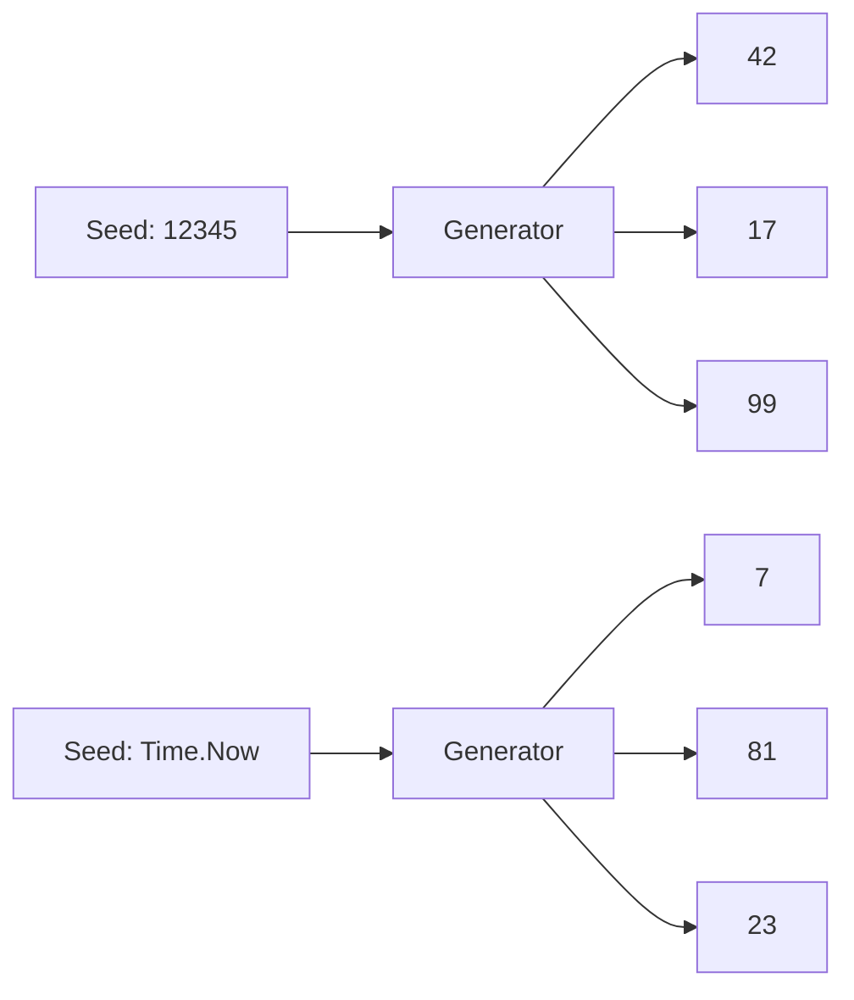

# TM.4 Randomness: Managing Unpredictability

## Mission

Master the generation of random data in Go using the modern `math/rand/v2` package (introduced in Go 1.22). Learn the difference between Pseudo-randomness and Cryptographic randomness, and how to use seeding for deterministic testing.

## Prerequisites

- `TM.3` timers-and-tickers

## Mental Model

Think of a Pseudo-random Number Generator (PRNG) as **A Long, Predetermined List of Numbers**.

1. **The List (`Algorithms`)**: The algorithm (like PCG or ChaCha8) is a mathematical formula that generates a sequence of billions of "random-looking" numbers.
2. **The Bookmark (`Seed`)**: The seed is where you start reading from the list.
   - If you use the **Same Seed**, you always start at the same page and see the **Same Numbers**. This is great for debugging.
   - If you use a **Random Seed** (like the current time), it's like opening the book to a random page every time you start the program.

## Visual Model



## Machine View

- **V1 vs V2**: In older Go versions (`math/rand`), generating random numbers in 1,000 goroutines caused a massive bottleneck because the generator used a single `sync.Mutex` lock. `math/rand/v2` removes this lock entirely, making it safe and fast for massive concurrency.
- **Algorithms**: `v2` uses the **ChaCha8** and **PCG** algorithms, which are significantly faster and more "random" (better statistical distribution) than the older Mersenne Twister.
- **Source**: A `rand.Source` provides the raw bits; a `rand.Rand` object provides the helper methods like `IntN` or `Shuffle`.

## Run Instructions

```bash
go run ./07-concurrency/01-concurrency/time-and-scheduling/4-random
```

## Code Walkthrough

### `rand.IntN(100)`
Returns a random integer in the range `[0, 100)`. It is the most common way to generate random IDs or indexes.

### `rand.Shuffle`
Takes a slice and a swap function. It is a highly optimized implementation of the Fisher-Yates shuffle algorithm.

### `rand.NewPCG(seed1, seed2)`
Creates a new source with two 64-bit seeds. This is the modern way to create reproducible "Islands" of randomness for tests.

### `math/rand/v2`
Note the import path. We are using the version 2 package, which is the current standard for Go engineers.

## Try It

1. Write a function that generates a random "Coupon Code" (6 capital letters).
2. Use `rand.Perm(10)` to generate a random ordering of numbers from 0 to 9.
3. Compare the output of `math/rand/v2` with `crypto/rand`. (Hint: `crypto/rand` is for security but is much slower).

## Verification Surface

Observe how the same seed produces identical sequences, while the time-based seed varies:

```text
random number between 1 to 99: 42

Sequence from rng1 (seed 12345, 67890):
  IntN(100): 81, Float64: 0.1234
  IntN(100): 12, Float64: 0.5678

Sequence from rng2 (same seed 12345, 67890):
  IntN(100): 81, Float64: 0.1234  <-- MATCH!
```

## In Production
**Never use `math/rand` for security.**
Pseudo-random numbers are predictable if you know the seed. If you are generating passwords, session tokens, or encryption keys, **you must use `crypto/rand`**.
`math/rand` is for simulations, games, load balancing, and UI effects.

## Thinking Questions
1. Why does `math/rand/v2` require two seeds (`uint64, uint64`) for its PCG source?
2. What happens if you seed a generator with `0`?
3. In a load balancer, why might you use a random shuffle to pick a server?

## Next Step

We've learned to generate random events. Now let's learn how to schedule them precisely in the future. Continue to [TM.5 Task Scheduling](../5-schedule/README.md).
