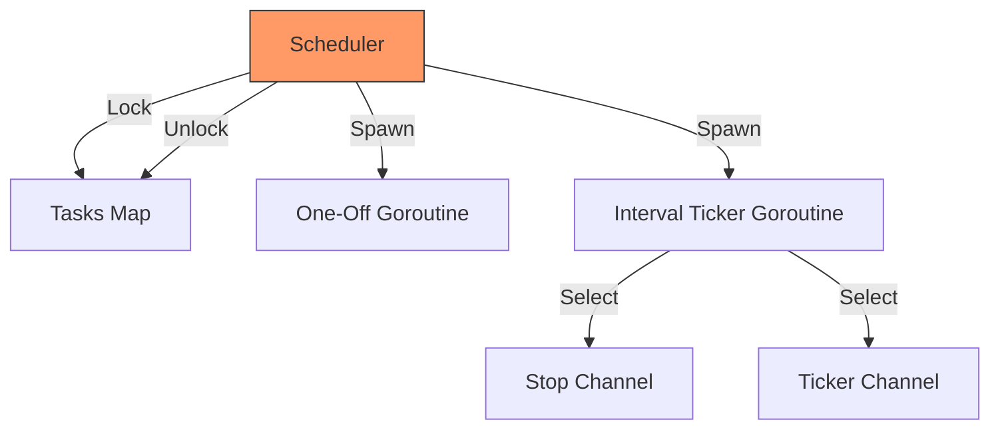

# TM.5 Task Scheduling: Building a Cron Engine

## Mission

Build a custom, concurrent Task Scheduler from scratch. Learn how to manage the lifecycle of background jobs, implement thread-safe task management using `sync.Mutex`, and orchestrate graceful shutdowns using `sync.WaitGroup` and cancellation channels.

## Prerequisites

- `TM.3` timers-and-tickers

## Mental Model

Think of a Task Scheduler as **A Project Manager**.

1. **The Assignment (`ScheduleOnce`)**: A one-time task that needs to be done later.
2. **The Routine (`ScheduleInterval`)**: A recurring task (like a daily standup or a database backup).
3. **The Ledger (`Scheduler Struct`)**: A central list where the manager tracks who is working on what.
4. **The Stop Order (`StopAll`)**: The manager tells everyone to finish their current work and go home (Graceful Shutdown).

## Visual Model



## Machine View

- **Thread Safety**: Because multiple goroutines might try to schedule or stop tasks at the same time, we must protect the internal `map[string]*Task` using a `sync.Mutex`. Without this, the program would crash with a concurrent map write panic.
- **Graceful Shutdown**: By using a global `sync.WaitGroup`, the scheduler can "Block" the main program until every background task has confirmed it has exited. This prevents "Zombies" (goroutines that keep running after the main process thinks it's done).
- **Actor Pattern**: Each task runs in its own goroutine and "listens" for commands via its `stopChan`.

## Run Instructions

```bash
go run ./07-concurrency/01-concurrency/time-and-scheduling/5-schedule
```

## Code Walkthrough

### `ScheduleInterval`
This method creates a background goroutine that uses a `select` statement to toggle between a `time.Ticker` (for work) and a `stopChan` (for cleanup).

### `StopTask`
This demonstrates how to "Signal" a background goroutine to stop. By calling `close(task.stopChan)`, all goroutines listening to that channel are instantly unblocked, allowing them to return gracefully.

### The Global WaitGroup
We `Add(1)` to the `globalWg` for every task spawned and `Done()` only when the goroutine exits. This ensures the main program can wait for full completion.

### Thread-Safe Map
Notice the `mu.Lock()` and `mu.Unlock()` around every access to the `tasks` map. This is non-negotiable for any shared state in Go.

## Try It

1. Enable `scheduler.AutoStopAll(5 * time.Second)` in `main()`. Observe how it kills the recurring backup task.
2. Add a `ScheduleCron` method that parses a cron string (or just a simplified version) to run at specific minutes.
3. What happens if a task's `action()` function panics? (Hint: It crashes the whole scheduler!). Add a `recover()` to the worker goroutine to make it resilient.

## Verification Surface

Observe the scheduler lifecycle in the logs:

```text
[11:30:40.000] SCHEDULER: Scheduling one-off task 'test' to run after 2s
[11:30:40.000] SCHEDULER: Scheduling interval task 'test-interval' with initial delay 1s, interval 3s

[11:30:41.000] TASK 'test-interval': Executing first action.
Running database backup in realtime

[11:30:42.000] TASK 'test': Executing one-off action.
Running test...
```

## In Production
**Don't build your own scheduler for critical business logic.**
While this exercise is excellent for learning concurrency patterns, for production-grade background jobs, use battle-tested libraries like `robfig/cron` or distributed task queues like `Asynq` or `Temporal`. Home-grown schedulers are difficult to scale across multiple server instances.

## Thinking Questions
1. Why do we need both a `globalWg` and a task-specific `wg`?
2. Why is `close(chan)` used for the stop signal instead of sending a value like `ch <- true`?
3. How would you modify the scheduler to persist tasks to a database so they survive a server restart?

## Next Step

We've mastered scheduling. Now let's learn how to handle the "Where" of time: Timezones and Locations. Continue to [TM.6 Timezones](../6-timezone/README.md).
