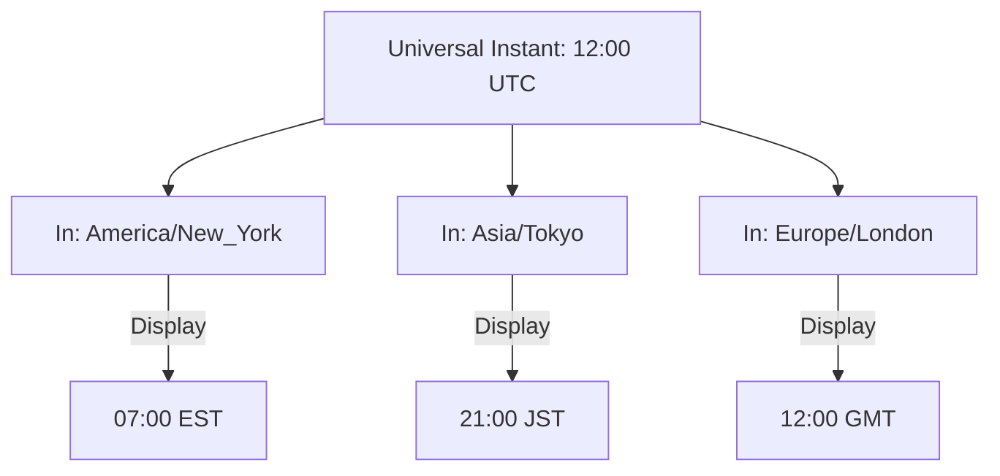

# TM.6 Timezones: The Geography of Time

## Mission

Master `time.Location` and the IANA Time Zone database. Learn how to convert a single point in time across global offsets and understand why "UTC-Everywhere" is the only valid architecture for production backends.

## Prerequisites

- `TM.5` schedule

## Mental Model

Think of Timezones as **A Camera Lens Filter**.

1. **The Scene (`time.Time`)**: This is the absolute reality-the exact moment a photon hit the sensor. It is universal.
2. **The Filter (`time.Location`)**: This is the lens you look through. One lens makes it look like it happened at 4 PM in New York, another lens makes it look like it happened at 6 AM the next day in Tokyo.
3. **The Result**: The **Scene** hasn't changed; only your **Perspective** of it has.

## Visual Model



## Machine View

- **IANA Database**: Go uses the standard IANA Time Zone database (also known as the "Zoneinfo" database). On Linux/macOS, it reads this from the OS. On Windows, Go bundles a copy of the database.
- **Location Object**: A `*time.Location` is a pointer to a struct that contains all the rules for a specific region: its offset from UTC, and its history of Daylight Savings Time (DST) changes.
- **Offsets**: `time.Time` internally stores seconds since the Unix epoch in UTC. When you call `.In(location)`, Go simply applies the offset rules to the internal value for display.

## Run Instructions

```bash
go run ./07-concurrency/01-concurrency/time-and-scheduling/6-timezone
```

## Code Walkthrough

### `time.LoadLocation("Region/City")`
This is how you get a handle on a specific timezone. Common values include `"America/New_York"`, `"Europe/Berlin"`, or `"Asia/Dubai"`.

### `t.In(loc)`
This does **not** change the time; it returns a new `time.Time` object that is set to display according to the rules of the provided location.

### `t.UTC()`
A convenience method to return the time in the Universal Coordinated Time (UTC) location.

### `time.Date(...)`
When creating a date manually, you should always provide a location. Providing `time.UTC` is the safest default.

## Try It

1. Find out what time it will be in **Sydney, Australia** when the clock strikes midnight on New Year's Eve in **London**.
2. Try to load a location that doesn't exist (e.g., `"Mars/BaseAlpha"`). Handle the error gracefully.
3. Calculate the duration between "10:00 AM EST" and "10:00 AM PST". (Hint: It's 3 hours!).

## Verification Surface

Observe how the same moment shifts across the globe:

```text
Current local time: 2026-04-29 11:30:40...

Same moment in different timezones:
New York:  2026-04-29 01:30:40 -0400 EDT
Tokyo:     2026-04-29 14:30:40 +0900 JST
London:    2026-04-29 06:30:40 +0100 BST
UTC:       2026-04-29 05:30:40 +0000 UTC
```

## In Production
**UTC Everywhere.**
1. **Server Clock**: Set your servers to UTC.
2. **Database**: Store all timestamps as UTC.
3. **Internal Logic**: Perform all calculations in UTC.
4. **Presentation**: Only convert to a user's local timezone at the "Edge"-the last line of code before sending the data to the browser or mobile app.

Failing to do this will lead to "Time Corruption" during DST transitions (where you might lose an hour of logs or double-bill a customer).

## Thinking Questions
1. Why doesn't Go use simple integer offsets like `+5` instead of names like `"Asia/Karachi"`? (Hint: DST!).
2. What happens if you parse a time string that has an offset (like `-0700`) but no location name?
3. What is a "Leap Second" and does Go's `time` package account for it?

## Next Step

We've mastered the theory. Now let's build something practical. Continue to [TM.7 Console Reminder](../7-reminder/README.md).
