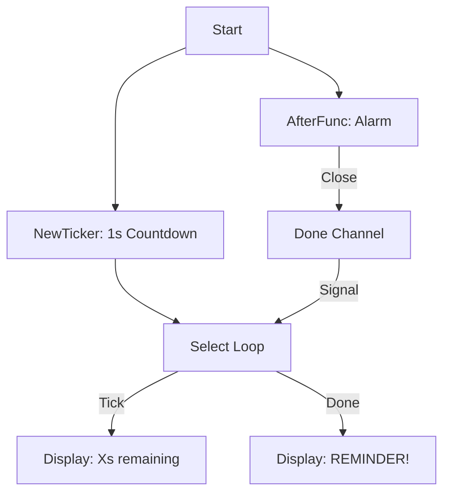

# TM.7 Project: Console Reminder

## Mission

Put your time and scheduling knowledge into practice by building a functional CLI tool. Learn how to combine `time.AfterFunc` for one-shot execution with `time.Ticker` for live countdown updates, and orchestrate the two using a `select` statement.

## Prerequisites

- `TM.6` timezone

## Mental Model

Think of this project as **A Digital Egg Timer**.

1. **The Dial (`CommandLine`)**: You set the duration (e.g., 5 seconds).
2. **The Alarm (`AfterFunc`)**: You schedule a function to "ding" when the time is up.
3. **The Display (`Ticker`)**: You set a separate 1-second interval to update the countdown text on the screen.
4. **The Synchronizer (`select`)**: You coordinate between the "display" ticks and the "final ding" signal.

## Visual Model



## Machine View

- **AfterFunc**: Unlike `NewTimer`, `AfterFunc` executes the provided function in its own **newly spawned goroutine**. It doesn't use a channel to communicate back; you must provide that mechanism yourself (e.g., the `done` channel).
- **Non-Blocking Ticker**: The ticker runs in the background. If your loop takes 0.5 seconds to process a tick, the ticker doesn't care; it will still deliver the next tick at the 1.0 second mark accurately.
- **Cleanup**: By calling `ticker.Stop()`, you remove the periodic work from the runtime heap. If you forgot this, and you launched 1,000 reminders, your CPU would be busy firing 1,000 "phantom ticks" per second!

## Run Instructions

```bash
go run ./07-concurrency/01-concurrency/time-and-scheduling/7-reminder 5 "Take a break!"
```

## Solution Walkthrough

- **time.AfterFunc(duration, func)**: Schedules a task for the future. It returns a `*time.Timer`, which you can use to `Stop()` the reminder if the user changes their mind.
- **time.NewTicker(1 * time.Second)**: Used to update the UI. We use the `ticker.C` channel to drive the loop.
- **Multiplexing with select**: The `select` statement allows our program to wait for the next tick **OR** the final alarm at the same time. Whichever happens first triggers its case.
- **Parsing Arguments**: We use `os.Args` to read the seconds and message from the user. We convert the string to an integer using `strconv.Atoi` and multiply it by `time.Second` to get a valid Go duration.


## Try It

1. Add a "Snooze" feature: after the reminder fires, ask the user if they want to snooze for another 5 seconds.
2. Modify the countdown to be more precise (e.g., every 100ms).
3. Use `time.Now().Add(duration)` to show the user the **exact time** the reminder will fire in their local timezone.

## Verification Surface

Observe the live countdown followed by the final reminder message:

```text
=== Console Reminder ===

⏰ Reminder set for 5s from now.

  ⏳ 4 seconds remaining...
  ⏳ 3 seconds remaining...
  ⏳ 2 seconds remaining...
  ⏳ 1 seconds remaining...

🔔 REMINDER: Take a break!
```

## In Production
**Don't rely on `time` for long-term persistence.**
If your server restarts, all scheduled `AfterFunc` tasks are lost forever. For persistent reminders (like an email reminder scheduled for next week), you must store the target timestamp in a database and use a "Sweeper" pattern or a dedicated task queue (like `Temporal` or `SQS`).

## Thinking Questions
1. Why does `AfterFunc` run the function in its own goroutine?
2. What happens if you call `ticker.Stop()` but keep trying to read from `ticker.C`? (Hint: The channel is never closed!).
3. How could you modify this program to handle multiple reminders simultaneously?

## Next Step

Next: `CP.1` -> `07-concurrency/02-concurrency-patterns/1-errgroup`

Open `07-concurrency/02-concurrency-patterns/1-errgroup/README.md` to continue.
