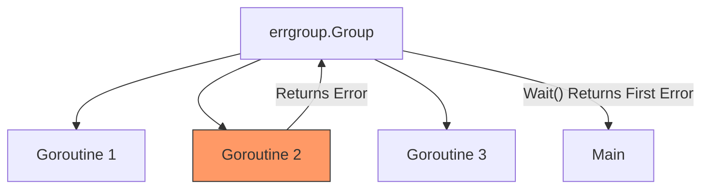

# CP.1 errgroup: Synchronized Error Collection

## Mission

Master the `errgroup` package-the professional standard for managing multiple goroutines that can fail. Learn why `sync.WaitGroup` is often the wrong tool when errors are involved, and how to use `errgroup` to collect results while failing fast.

## Prerequisites

- `TM.1` to `TM.7`

## Mental Model

Think of `errgroup` as **A Team of Experts**.

1. **The Goal (`g.Wait`)**: The team needs to complete several tasks before they can move to the next phase.
2. **The Result**:
   - If everyone succeeds, the team moves forward (nil error).
   - If even **one** expert fails, the team leader reports that failure to you immediately (`g.Wait` returns the error).
3. **The Efficiency**: The leader doesn't bother telling you about every single mistake. They just report the **first** person who messed up, as that's usually enough to stop the whole operation.

## Visual Model



## Machine View

- **Waitability**: Like `sync.WaitGroup`, `errgroup` tracks the number of active goroutines.
- **First-Error Guarantee**: Internally, `errgroup` uses a `sync.Once` and a `sync.Mutex` to store only the first non-nil error returned by any of its goroutines.
- **Limiters**: The `SetLimit(n)` method allows you to bound concurrency (e.g., "only 10 database queries at a time"), preventing your app from overwhelming external resources.

## Run Instructions

```bash
go run ./07-concurrency/02-concurrency-patterns/1-errgroup
```

## Code Walkthrough

### `g.Go(func() error)`
This replaces the `go func() { ... }` syntax. It handles the `Add()` and `Done()` logic for you automatically. If the function returns an error, the group captures it.

### `g.Wait()`
Blocks until all goroutines finished. It returns the **first** error it encountered.

### `SetLimit(n)`
A modern addition to the package. It ensures that no more than `n` goroutines are active at any given time. This is a "Semaphore-Lite" built directly into the group.

### `TryGo`
Returns `false` if the limit has been reached, allowing you to implement custom backoff or prioritization logic.

## Try It

1. Fix the `payment-gateway` error in the code. Watch the entire health check succeed.
2. Change the limit to `1` in the bounded concurrency example. Observe how workers are executed strictly one after another.
3. Use `errors.Join` to collect **all** errors from an `errgroup` by manually pushing them into a slice within each goroutine (careful with the Mutex!).

## Verification Surface

Observe how the group handles a failing health check and manages bounded concurrency:

```text
=== errgroup: startup health checks ===
[FAIL] Health check failed (750ms): payment-gateway: connection refused (port 9443)

=== Collecting all errors with errors.Join ===
Found 1 failing services:
payment-gateway: connection refused (port 9443)

=== TryGo: bounded concurrency (max 2 at a time) ===
  worker 0 started
  worker 1 started
  worker 0 done
  worker 2 started
```

## In Production
**Don't ignore the error from `g.Wait()`.**
The whole point of `errgroup` is to handle failures. If you ignore the return value, you are essentially using a more expensive and slower version of `sync.WaitGroup`.
Also, remember that `errgroup` only captures the **first** error. If you need a comprehensive report of every failure, you must collect them manually into a thread-safe slice.

## Thinking Questions
1. Why does `g.Go` take a function that returns an `error` instead of a function that takes no arguments?
2. What is the difference between `g.Wait()` and `wg.Wait()`?
3. How does `errgroup` handle panics inside a goroutine? (Hint: It doesn't! It will crash the app just like a normal `go` routine).

## Next Step

We've learned the basics. Now let's see how to combine `errgroup` with `context` to cancel the whole group as soon as one fails. Continue to [CP.2 errgroup with Context](../2-errgroup-context/README.md).
