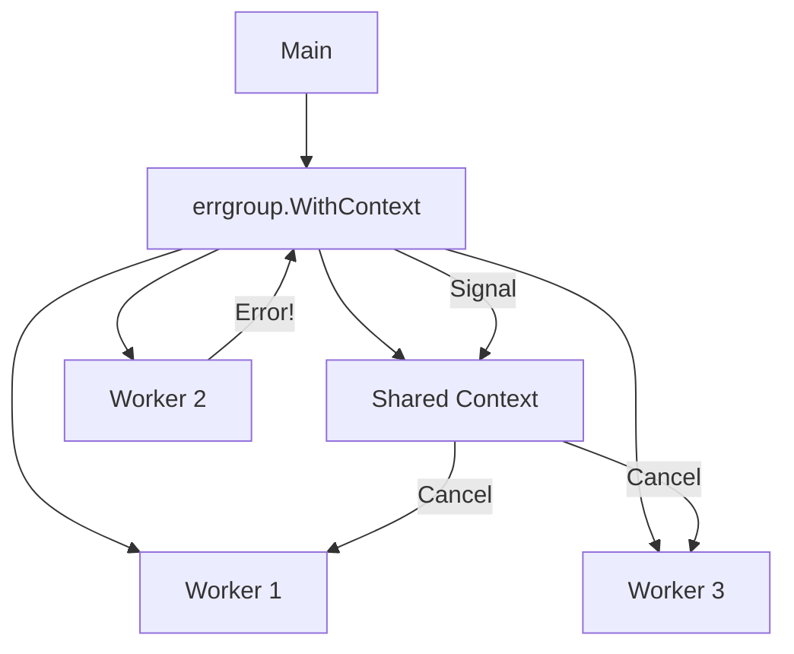

# CP.2 errgroup with Context: Automatic Self-Destruct

## Mission

Master the "Fail-Fast" pattern using `errgroup.WithContext`. Learn how to link a group of goroutines to a single cancellation signal, ensuring that if any worker fails, the entire fleet stops immediately to save resources.

## Prerequisites

- `CP.1` errgroup-basics

## Mental Model

Think of `errgroup.WithContext` as **A Distributed Self-Destruct Sequence**.

1. **The Mission (`Group`)**: You launch 10 drones (goroutines) to scan a large area.
2. **The Link (`Context`)**: All drones are connected to a single radio frequency.
3. **The Trigger**: If drone #4 crashes (returns an error), it broadcasts a self-destruct signal to the frequency.
4. **The Result**: Every other drone hears the signal (`<-ctx.Done()`) and returns to base immediately. You don't waste battery (CPU/RAM) on a mission that has already failed.

## Visual Model



## Machine View

- **Context Lifecycle**: `errgroup.WithContext` returns both a `Group` and a `Context`.
- **Cancellation**: The context is cancelled automatically under two conditions:
  1. Any of the functions passed to `g.Go` returns a non-nil error.
  2. `g.Wait()` returns (all goroutines are finished).
- **Graceful Termination**: Workers must explicitly listen to `<-ctx.Done()` inside their loops or I/O operations. If they don't, the context signal will be ignored, and they will keep running-defeating the purpose of the pattern.

## Run Instructions

```bash
go run ./07-concurrency/02-concurrency-patterns/2-errgroup-context
```

## Code Walkthrough

### `errgroup.WithContext`
This is the standard way to initialize an `errgroup` in production. It ensures that your goroutines aren't "islands"-they are part of a coordinated fleet.

### The Producer/Consumer Pattern
- **Producer**: Generates work and sends it to a channel. It MUST listen to `ctx.Done()` to stop generating work if a consumer fails.
- **Consumer**: Pulls work from the channel and processes it. It MUST listen to `ctx.Done()` before starting every task.

### `err != context.Canceled`
When checking the error from `g.Wait()`, it is common to ignore `context.Canceled`. This is because one goroutine's error caused the others to be cancelled; the "Cancellation" is a symptom, not the root cause.

## Try It

1. Comment out the `rand.Intn` failure logic in the consumer. Watch the entire pipeline finish successfully.
2. Remove the `select` with `ctx.Done()` from the producer. Notice how it keeps trying to queue work even after the consumers have stopped.
3. Add a "Timeout" to the parent context. Watch the whole group shut down if it takes longer than 1 second.

## Verification Surface

Observe how one worker failure triggers a warning in the producer and shuts down the pipeline:

```text
=== Fan-out pipeline with errgroup.WithContext ===
INFO work item queued url=https://...
INFO worker processing worker_id=1 url=...
WARN producer cancelled reason="context canceled" sent=4
[FAIL] Pipeline failed: worker 2: connection reset on ...
```

## In Production
**Propagate the Context.**
Always pass the context down to the lowest-level I/O operations (like `sql.QueryContext` or `http.NewRequestWithContext`). If your consumers perform I/O without passing the context, they cannot be cancelled, and they will stay blocked on a network socket while the rest of the system is shutting down.

## Thinking Questions
1. Why does `errgroup` cancel the context only on the **first** error?
2. What happens if you use a context that was already cancelled as the parent for `errgroup.WithContext`?
3. How does this pattern help prevent "Cascading Failures" in a microservice architecture?

## Next Step

Next: `CP.3` -> `07-concurrency/02-concurrency-patterns/3-sync-pool`

Open `07-concurrency/02-concurrency-patterns/3-sync-pool/README.md` to continue.
