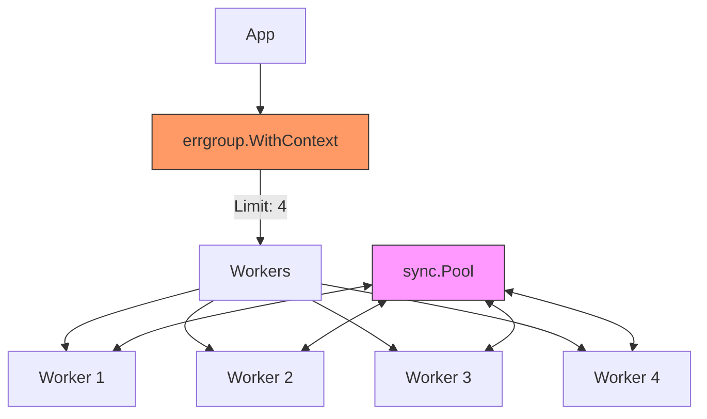

# CP.4 Project: Bounded Image Pipeline

## Mission

Combine everything you've learned about Concurrency, Context, and Memory Management into a production-grade architecture. Build a bounded image-processing pipeline that prevents resource exhaustion, fails fast on corrupted data, and recycles memory to keep the Garbage Collector quiet.

## Prerequisites

- `CP.3` sync-pool

## Mental Model

Think of this project as **A Modern Car Factory**.

1. **The Limit (`SetLimit`)**: The factory only has 4 assembly robots (concurrency limit). Even if you have 1,000 cars to build, only 4 can be on the line at once.
2. **The Tools (`sync.Pool`)**: Instead of throwing away the welding masks after every car, the robots return them to a tool chest for the next robot to use.
3. **The Emergency Stop (`errgroup.WithContext`)**: If one car is found to have a critical safety flaw (`imgError`), someone pulls the lever, and all robots stop working immediately.

## Visual Model



## Machine View

- **Bounded Concurrency**: By using `g.SetLimit(4)`, we ensure that our application's CPU and Memory usage is "Capped." No matter how many images we throw at it, it will only ever process 4 at a time, protecting the server from OOM (Out of Memory) crashes.
- **Buffer Recycling**: Processing images requires large chunks of memory. By using `sync.Pool`, we allocate a few 2MB buffers and reuse them millions of times. This significantly reduces "GC Pauses"-those moments where your app freezes so the Go runtime can clean up memory.
- **Fail-Fast**: If an image is corrupt, the entire batch job is aborted. This is critical for data integrity.

## Run Instructions

```bash
go run ./07-concurrency/02-concurrency-patterns/4-bounded-pipeline-exercise
```

## Solution Walkthrough

- **errgroup.WithContext + SetLimit**: This is the heart of the pipeline. It coordinates the workers and enforces the boundary.
- **sync.Pool with bytes.Buffer**: Notice the `New` function returns a buffer with a pre-allocated capacity of 2MB. This prevents "Growth" allocations during the processing of average-sized images.
- **The Worker Logic (processImage)**:
  1. **Context Check**: Before starting any work, the worker checks if the context is already cancelled.
  2. **Resource Acquisition**: Grabs a buffer from the pool.
  3. **Work**: Simulates image processing with `time.Sleep`.
  4. **Cleanup**: Resets and returns the buffer to the pool via a `defer`.


## Try It

1. Increase the limit to `10`. Watch how much faster the batch job completes.
2. Remove the `imgError` from the slice. Verify that all images are processed successfully.
3. Track how many times `New` is actually called in the pool by adding a counter inside the `New` function. Compare that to the total number of images processed. (Hint: It should be close to the concurrency limit!).

## Verification Surface

Observe the bounded processing and the immediate shutdown when `imgError` is encountered:

```text
Starting batch job...
2024/04/29 11:30:40 Processed img1 (buffer capacity: 2097152)
2024/04/29 11:30:40 Processed img2 (buffer capacity: 2097152)
2024/04/29 11:30:40 Processed img3 (buffer capacity: 2097152)
2024/04/29 11:30:40 Processed img4 (buffer capacity: 2097152)
[FAIL] Batch job failed: corrupt image data for imgError
```

## In Production
**Calculate your limits based on hardware.**
A concurrency limit of `4` might be too low for a 64-core server, and too high for a 1-core Lambda function. A good rule of thumb is `runtime.NumCPU()` for CPU-bound tasks, and a higher multiple (e.g., `NumCPU * 10`) for I/O-bound tasks like network requests.

## Thinking Questions
1. Why do we check `ctx.Done()` at the very beginning of `processImage`?
2. What would happen to the memory usage if we didn't use `sync.Pool`?
3. How can you handle a scenario where you want the pipeline to **continue** even if one image fails? (Hint: Don't return an error from `g.Go`).

## Next Step

We've mastered the bounded pipeline. Now let's apply it to a real-world network problem: building a high-speed URL status checker. Continue to [CP.5 URL Checker](../5-url-checker-exercise/README.md).
