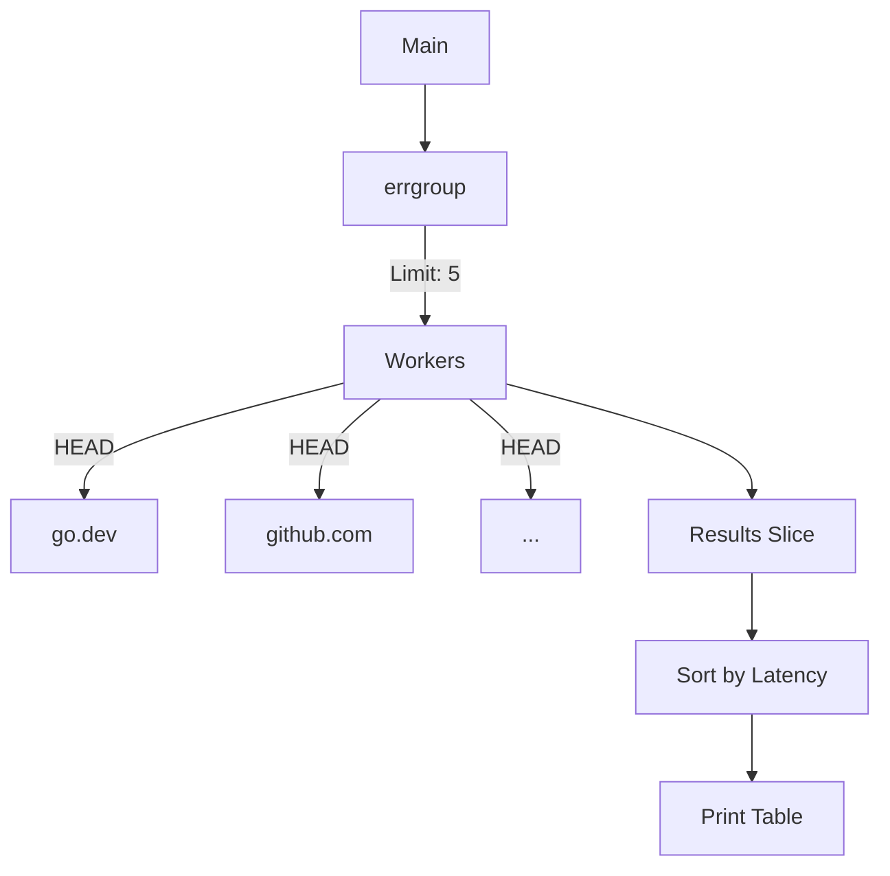

# CP.5 Project: URL Health Checker

## Mission

Build a high-performance URL Health Checker that can scan hundreds of endpoints simultaneously without overwhelming the network or your own system. Learn how to combine `errgroup` for fan-out, `sync.Pool` for client reuse, and `sort` for presentation.

## Prerequisites

- `CP.4` bounded-pipeline

## Mental Model

Think of this project as **A Team of Mystery Shoppers**.

1. **The List (`urls`)**: You have a list of 50 stores to check.
2. **The Shoppers (`Workers`)**: You hire 5 shoppers (`SetLimit: 5`).
3. **The Script (`http.MethodHead`)**: You tell them, "Don't buy anything; just check if the door is open and the lights are on." (HEAD request is faster than GET).
4. **The Report (`Results Slice`)**: Each shopper reports back with how long it took to get there and if the store was open.
5. **The Summary**: You sort the reports by speed to see which stores are the most responsive.

## Visual Model



## Machine View

- **HEAD Request**: Using `http.MethodHead` tells the server to only send the headers, not the entire HTML body. This saves bandwidth and reduces latency for both you and the server.
- **Client Reuse**: `http.Client` objects are thread-safe and designed for reuse. By pooling them (or simply using a single shared client), you benefit from **Keep-Alive** connections. This means Go doesn't have to re-negotiate the TCP/TLS handshake for every request to the same host.
- **Wait vs Results**: Note that we return `nil` from `g.Go`. This is because we want the checker to continue even if one URL is down. We capture the error inside our `CheckResult` struct instead of failing the whole group.

## Run Instructions

```bash
go run ./07-concurrency/02-concurrency-patterns/5-url-checker-exercise
```

## Solution Walkthrough

- **http.Client Pooling**: We use `sync.Pool` to manage our HTTP clients. Each client has a 5-second timeout. This prevents one "zombie" server from blocking our entire checker forever.
- **The results Slice**: We pre-allocate a slice of exactly the right size: `make([]CheckResult, len(urls))`. Because each goroutine writes to its own specific index `i`, we don't need a Mutex to protect this slice! This is a high-performance "Disjoint Write" pattern.
- **sort.Slice**: After `g.Wait()` returns, we know the slice is full. We use the standard library's sort package to re-order the results based on latency before printing them.


## Try It

1. Add a URL that doesn't exist (e.g., `https://this-is-not-a-real-site.com`). Observe how the checker handles the network error gracefully.
2. Change the limit to `1`. Observe that the "Total Time" now matches the "Sequential Time."
3. Instead of a HEAD request, change it to a GET request and read the `Content-Length` header.

## Verification Surface

Observe the table of results sorted by speed:

```text
=== URL Health Checker ===

RESULT  URL                                           STATUS   LATENCY
------  ---                                           ------   -------
OK      https://go.dev                                200      120ms
OK      https://github.com                            200      150ms
OK      https://httpbin.org/status/200                200      250ms

Total time: 260ms (would be 850ms sequential)
```

## In Production
**Don't use `http.DefaultClient`.**
The default client has no timeout. If a server accepts a connection but never sends data, your goroutine will hang forever. Always create your own `http.Client` with a strict `Timeout` (as seen in the `New` function of our pool).

## Thinking Questions
1. Why is a HEAD request better than a GET request for a health checker?
2. If we have 1,000 URLs to check, what is a reasonable `SetLimit`?
3. How can we modify this to stop as soon as we find **one** failing URL? (Hint: Return an error from `g.Go`).

## Next Step

Next: `TE.1` -> `08-quality-test/01-quality-and-performance/testing/user`

Open `08-quality-test/01-quality-and-performance/testing/user/README.md` to continue.
