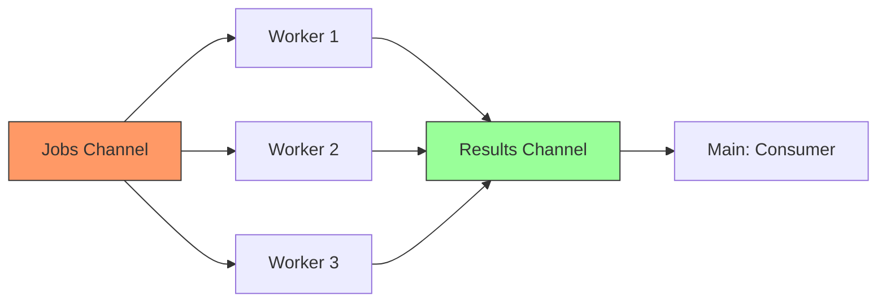

# CP.6 Worker Pool: Orchestrating the Fleet

## Mission

Master the "Worker Pool" pattern-the most powerful and flexible architecture for high-concurrency Go services. Learn how to explicitly cap your resource usage, implement graceful shutdowns, and build resilient systems that can recover from individual worker panics without crashing the entire application.

## Prerequisites

- `CP.5` url-checker

## Mental Model

Think of a Worker Pool as **A Fast-Food Kitchen**.

1. **The Order Queue (`jobs` channel)**: Customers (the rest of the app) place orders for burgers.
2. **The Kitchen Staff (`Workers`)**: You have exactly 3 cooks. Even if 100 orders come in at once, only 3 burgers are being flipped at any given time. This keeps the kitchen from catching fire (OOM/CPU saturation).
3. **The Counter (`results` channel)**: When a burger is ready, the cook places it on the counter for the customer to pick up.
4. **The Cleanup (`Graceful Shutdown`)**: When the restaurant closes, the cooks finish the burgers they've already started, but they don't take any new orders.

## Visual Model



## Machine View

- **Channel Multiplexing**: Many goroutines (workers) are reading from the same `jobs` channel. The Go scheduler handles the complexity of "Handing off" a job to exactly one available worker.
- **Panic Isolation**: By using `defer recover()` inside the worker, we ensure that if a specific job triggers a bug (e.g., a null pointer), only that one worker is affected for a split second. It reports the error and goes right back to the next job in the queue.
- **Memory Capping**: By setting the number of workers to a fixed constant (e.g., `numWorkers = 10`), you are effectively capping your peak RAM and File Descriptor usage, regardless of how many millions of jobs are in the queue.

## Run Instructions

```bash
go run ./07-concurrency/02-concurrency-patterns/6-worker-pool
```

## Code Walkthrough

### The Worker Loop
The worker uses a `for { select { ... } }` pattern. It listens for EITHER a `ctx.Done()` (shutdown signal) or a new job from the `jobs` channel.

### `processJobSafe`
This is a critical production pattern. It wraps the actual business logic in a "Safety Shell" that catches panics and converts them into standard Go `error` types returned via the `results` channel.

### Graceful Shutdown
1. **Close the Queue**: `close(jobs)` tells the workers no more work is coming.
2. **Wait for Draining**: `wg.Wait()` blocks until the workers have finished everything currently in the buffer.
3. **Close Results**: Only after all workers are done do we close the `results` channel, signaling the main consumer that the report is finished.

## Try It

1. Change `numWorkers` to `1`. Observe that the jobs are now processed sequentially.
2. Hit `Ctrl+C` while the program is running. Watch the workers notice the cancellation signal and shut down immediately.
3. Add a "Retry" mechanism: if a job fails, the main consumer should try to re-queue it one time.

## Verification Surface

Observe the concurrent execution, the recovered panic, and the final results:

```text
Worker 1 starting job 1...
Worker 2 starting job 2...
Worker 3 starting job 3...
❌ Failed job 3: panic in worker 3 processing job 3: simulated nasty bug
✅ Success job 1: Scraped data...
✅ Success job 2: Scraped data...

Done! Success: 9, Failures: 1
```

## In Production
**Buffer your channels carefully.**
A small buffer (e.g., `numWorkers * 2`) provides enough "Backpressure" to stop the producer if the workers are falling behind. A massive buffer (e.g., 10,000) might hide a performance bottleneck until it's too late and your RAM is exhausted.
Also, always monitor the "Depth" of your job queue in production to identify when you need to scale up your worker count.

## Thinking Questions
1. Why do we wait for workers in a separate goroutine?
2. What is the difference between `close(jobs)` and cancelling the `context`?
3. In what scenario would you want to use a Worker Pool instead of an `errgroup`? (Hint: Long-lived background services!).

## Final Step

Congratulations! You've finished the Concurrency track of The Go Engineer. You now have the skills to build some of the most complex and high-performance systems in the world. **Go build something great.**
