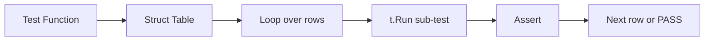

# TE.2 Table-Driven Tests

## Mission

Master the idiomatic Go pattern for testing multiple cases without duplicating test functions. Learn anonymous struct tables, sub-tests with `t.Run`, and how to keep test code DRY.

## Prerequisites

- TE.1 Unit Testing

## Mental Model

Think of a table-driven test as **A Judge With A Checklist**. Instead of examining one defendant at a time with a full ritual (separate test function), the judge has a clipboard listing all cases and quickly checks each one.

## Visual Model



## Machine View

- Each row in the table creates a real sub-test via `t.Run`. Sub-tests appear as separate entries in `go test -v` output.
- If a sub-test fails, other sub-tests in the same function continue running — unlike a top-level `t.Fatalf` which stops the whole function.
- The table is defined as an anonymous `[]struct{...}` literal — no named type required.

## Run Instructions

```bash
go test ./08-quality-test/01-quality-and-performance/02-testing/02-table-driven-tests
```

## Code Walkthrough

Two functions are tested:
- `ValidateEmail` checks email format (presence of @ and domain dot).
- `CalculateScore` returns a score capped at 100.

Both use table-driven tests with anonymous structs containing `desc`, `input`, and `want` fields. Each row is a sub-test via `t.Run`, so failures are reported per-case.

## Try It

1. Run `go test -v` and observe how each sub-test is reported by name.
2. Add a new test case to `TestValidateEmail` for an email with a hyphen in the domain.
3. Change `CalculateScore` to cap at 200 instead of 100. Update the tests accordingly.

## In Production

Table-driven tests are the standard in the Go standard library and major open-source projects. They make adding new cases a one-line change and provide clear failure output per case.

## Thinking Questions

1. Why use `t.Run` instead of just looping with `t.Errorf`?
2. What is the advantage of anonymous structs for test cases over named struct types?
3. How would you test a function that takes multiple inputs and returns multiple outputs?

## Next Step

Next: `TE.3` -> [`08-quality-test/01-quality-and-performance/02-testing/03-http-handler-testing`](../03-http-handler-testing/README.md)
