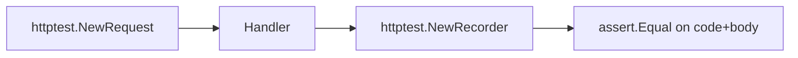

# TE.3 HTTP Handler Testing

## Mission

Learn how to test HTTP handlers without starting a real web server. Use `httptest.NewRecorder` to capture responses and `httptest.NewRequest` to mock incoming requests.

## Prerequisites

- TE.1 Unit Testing
- TE.2 Table-Driven Tests

## Mental Model

Think of `httptest` as **A Flight Simulator**. You do not need to board a real plane (start a real server) to practice emergency procedures. The simulator provides a realistic environment without the cost and risk of the real thing.

## Visual Model



## Machine View

- `httptest.NewRecorder` implements `http.ResponseWriter`. It records the status code, headers, and body written by the handler.
- `httptest.NewRequest` creates an `*http.Request` with any method, path, and body — no network socket involved.
- The entire test runs in a single goroutine: no ports, no listeners, no timeouts.

## Run Instructions

```bash
go test ./08-quality-test/01-quality-and-performance/02-testing/03-http-handler-testing
```

## Code Walkthrough

Two handlers are tested:
- `HelloWorldHandler` returns a static greeting.
- `EchoHandler` reads the POST body and echoes it back.

The tests use `httptest.NewRequest` to create synthetic requests and `httptest.NewRecorder` to capture the handler output. This pattern is faster and more reliable than starting a real server.

## Try It

1. Run `go test -v` and observe handler test outputs.
2. Add a new handler that returns JSON and test it with `httptest`.
3. Change `HelloWorldHandler` to return a different greeting. Does the test catch it?

## In Production

Use `httptest` for all HTTP handler tests. Reserve container-level integration tests for verifying middleware stacks, authentication, and database-backed endpoints.

## Thinking Questions

1. Why does `httptest.NewRecorder` implement `http.ResponseWriter`?
2. What would go wrong if you called `http.ListenAndServe` inside a unit test?
3. How would you test that a handler sets a specific response header?

## Next Step

Next: `TE.4` -> [`08-quality-test/01-quality-and-performance/02-testing/04-benchmarks`](../04-benchmarks/README.md)
