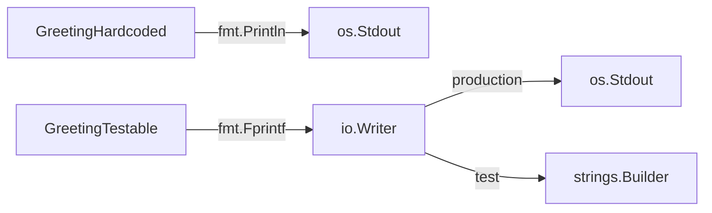

# TE.11 Testable Design with io.Writer

## Mission

Learn why hardcoding `os.Stdout` makes code untestable, and how accepting `io.Writer` enables clean, fast tests through dependency injection.

## Prerequisites

- TE.1 Unit Testing
- TE.2 Table-Driven Tests

## Mental Model

Think of `io.Writer` as **A Universal Outlet**. A lamp with a hardwired cord can only be used in one room. A lamp with a plug can be used anywhere there's an outlet. Similarly, a function that writes to `os.Stdout` is hardwired, while a function that accepts `io.Writer` can be plugged into any writer.

## Visual Model



## Machine View

- `os.Stdout` is a global variable of type `*os.File` which implements `io.Writer`.
- Hijacking it requires `os.Pipe()`, goroutine coordination, and global state mutation — not concurrent-safe.
- `strings.Builder` also implements `io.Writer`. Passing `&buf` is zero-allocation and goroutine-safe.

## Run Instructions

```bash
go test ./08-quality-test/01-quality-and-performance/02-testing/11-testable-design
```

## Code Walkthrough

Two functions do the same thing — print a greeting:

- `GreetingHardcoded`: Uses `fmt.Printf` which writes to `os.Stdout`. Testing it requires replacing `os.Stdout` with a pipe, reading from the pipe, and restoring the original — extremely brittle.
- `GreetingTestable`: Accepts `io.Writer` via `fmt.Fprintf`. Testing it requires only a `strings.Builder` and one assertion.

## Try It

1. Run `go test -v` to see both test approaches.
2. Add a third parameter to `GreetingTestable` and update its test.
3. Try running the hardcoded test with `-race` — it may or may not fail depending on parallelism.

## In Production

The `io.Writer` pattern is the foundation of Go's logging libraries. `log.Logger` accepts an `io.Writer`, `slog.New` accepts an `io.Writer`, and HTTP response writers implement `io.Writer`. Always accept the most general interface that does what you need.

## Thinking Questions

1. Why is mutating global state (`os.Stdout`) dangerous in tests?
2. What other standard library interfaces besides `io.Writer` enable testable design?
3. How would you test a function that reads from `os.Stdin`?

## Next Step

Next: `PR.1` -> [`08-quality-test/01-quality-and-performance/01-profiling/01-cpu-profile`](../../01-profiling/01-cpu-profile/README.md)
