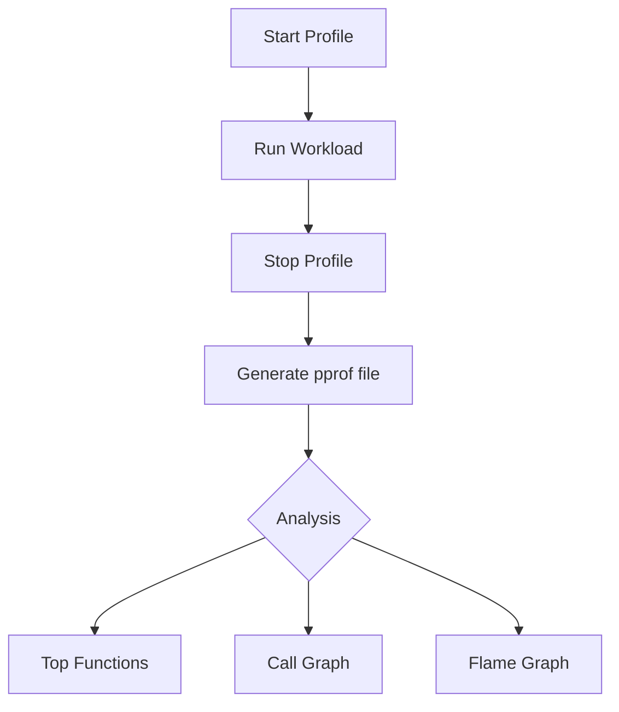

# PR.1 CPU Profiling

## Mission

Learn how to identify performance bottlenecks in your Go code using CPU profiling. Master the `pprof` tool to visualize where your program spends its time and distinguish between "Flat" and "Cumulative" costs.

## Prerequisites

- TE.4 Benchmarking

## Mental Model

Think of CPU Profiling as **A Time-Motion Study**.

1. **The Stopwatch**: Every few milliseconds, the Go runtime pauses the program and takes a "snapshot" of what every CPU core is doing.
2. **The Statistics**: After a few seconds, you have thousands of snapshots.
3. **The Hotspot**: If 50% of the snapshots show the program inside `CalculatePrime`, you know exactly where to spend your optimization effort.
4. **The Noise**: Functions that take very little time disappear from the statistics, allowing you to focus on the "Hot Path."

## Visual Model



## Machine View

- **Sampling**: Go's CPU profiler is a "sampling profiler." It has very low overhead because it doesn't track every single function call, only periodic samples.
- **`runtime/pprof`**: This is the package used for manual, offline profiling (starting and stopping the timer in code).
- **`go tool pprof`**: This is the interactive shell and visualization engine for reading profile data.

## Run Instructions

```bash
# Run the program to generate a 'cpu.prof' file
go run ./08-quality-test/01-quality-and-performance/profiling/1-cpu-profile

# Analyze the profile in the terminal
go tool pprof cpu.prof
# Inside pprof, type 'top' or 'list main'
```

## Code Walkthrough

### `main.go`
The code includes a "Heavy Workload" (e.g., intensive string manipulation or math). It uses `pprof.StartCPUProfile` to record the execution and `pprof.StopCPUProfile` to save the results.

## Try It

1. Run the code and open the profile. Which function is at the "Top"?
2. Use the `list` command inside `pprof` to see line-by-line timing for the hot function.
3. (Advanced) If you have Graphviz installed, try the `web` command to see a visual call graph.

## In Production
**Profile real workloads.** Profiling a program that is idling won't tell you anything. You must profile while the system is under load (either from a benchmark or a load-testing tool). CPU profiling adds about 1-5% overhead, which is low enough to be used in production for short bursts.

## Thinking Questions
1. What is the difference between `Flat` time and `Cum` (Cumulative) time?
2. Why might a function show high CPU usage but very low execution time in a benchmark?
3. How often does the Go CPU profiler take a sample?

## Next Step

Profiling a running server requires a different approach. Continue to [PR.2 Live pprof](../3-http-pprof).
