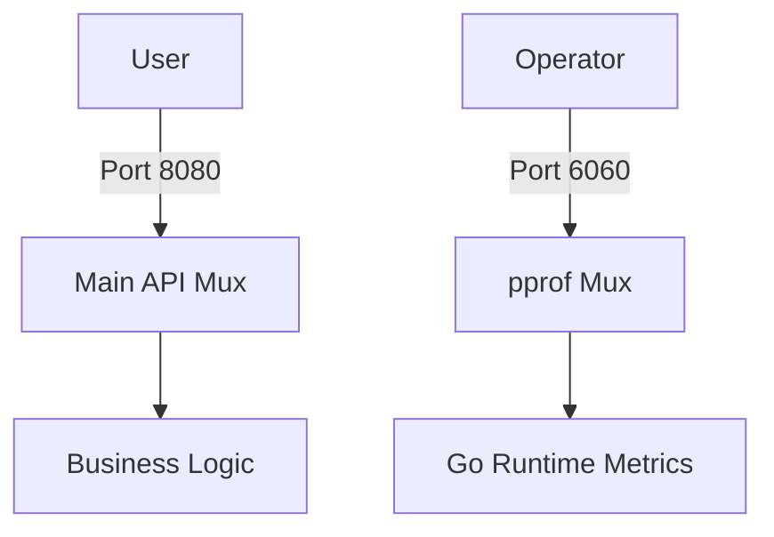

# PR.2 Live pprof Endpoint

## Mission

Learn how to expose profiling endpoints in a running Go service. Master the "Two-Port Pattern" to keep diagnostic data secure while allowing operators to inspect CPU, heap, and goroutines in real-time under production-like traffic.

## Prerequisites

- PR.1 CPU Profiling

## Mental Model

Think of Live pprof as **A Security Camera System**.

1. **The Building**: Your running service (e.g., an API on port 8080).
2. **The Camera**: The `net/http/pprof` package, which is always watching the runtime.
3. **The Control Room**: A separate, restricted port (e.g., 6060) where you can view the camera feeds.
4. **The Security**: You don't let customers walk into the control room. You keep the 6060 port behind a firewall or on an internal network.

## Visual Model



## Machine View

- **Blank Import**: `import _ "net/http/pprof"` automatically registers several endpoints under `/debug/pprof/` on the `http.DefaultServeMux`.
- **`http.DefaultServeMux`**: In production, never use the default mux for your public API, because any library (like pprof) can register handlers there. By using a custom mux for your API and the default mux for pprof, you isolate them.

## Run Instructions

```bash
# Run the demo server
go run ./08-quality-test/01-quality-and-performance/profiling/3-http-pprof
```

In a separate terminal, pull a 5-second CPU profile:
```bash
go tool pprof http://localhost:6060/debug/pprof/profile?seconds=5
```

Or view the heap (memory) usage:
```bash
go tool pprof http://localhost:6060/debug/pprof/heap
```

## Code Walkthrough

### The Two-Port Pattern
`main.go` starts two `http.ListenAndServe` calls in separate goroutines. One handles the public API, and the other handles the pprof diagnostics. This is the **Gold Standard** for production Go services.

## Try It

1. Start the server and use `curl http://localhost:8080/hello` to see the public API.
2. Try `curl http://localhost:8080/debug/pprof/`. It should fail (404), proving the public port is secure.
3. Try `curl http://localhost:6060/debug/pprof/`. It should succeed, showing the list of available profiles.

## In Production
**NEVER expose pprof to the public internet.** It is a severe security risk as it can leak environment variables, stack traces, and internal memory layouts. Always bind it to `localhost` or an internal VPC IP.

## Thinking Questions
1. Why does Go use a "Blank Import" for pprof?
2. If your server is "Locking up" (frozen), which pprof endpoint would you use to find the deadlocked goroutine?
3. How can you protect the pprof port if it must be accessible over a network?

## Next Step

Next: `PR.3` -> `08-quality-test/01-quality-and-performance/profiling/3-memory-profiling`

Open `08-quality-test/01-quality-and-performance/profiling/3-memory-profiling/README.md` to continue.
