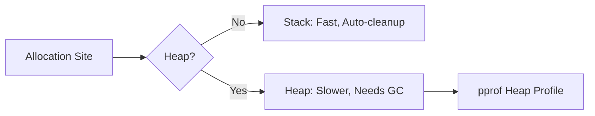

# PR.3 Memory Profiling

## Mission

Master the use of Heap Profiling to understand how your program uses memory. Learn to distinguish between "In-Use" memory (leaks) and "Allocated" memory (GC pressure), and identify exactly which lines of code are responsible for memory consumption.

## Prerequisites

- PR.1 CPU Profiling

## Mental Model

Think of Memory Profiling as **A Waste Audit**.

1. **The Bin**: Your program's memory is a bin.
2. **The Contents**: Some items in the bin are useful (live objects). Some are trash (garbage).
3. **The Audit**: `pprof --heap` looks at the bin and tells you: "This specific function threw away 10GB of paper today" (High Allocation Rate) and "This function is still holding onto a 1GB lead block" (Live Memory/Leak).
4. **The Goal**: Reduce the trash to keep the CPU from working too hard (GC pressure) and reduce the weight to keep the program from running out of memory (OOM).

## Visual Model



## Machine View

- **`alloc_objects`**: Total number of objects allocated since the program started. Useful for finding "Garbage Generators."
- **`inuse_objects`**: Number of objects currently in memory. Useful for finding "Memory Leaks."
- **Sampling**: Like CPU profiling, heap profiling is sampled (default is 1 sample per 512KB of allocation) to keep overhead low.

## Run Instructions

```bash
# Run the program to generate a 'mem.prof' file
go run ./08-quality-test/01-quality-and-performance/profiling/3-memory-profiling

# Analyze the memory profile
go tool pprof mem.prof
```

Inside pprof:
- `top`: See which functions own the most memory.
- `list`: See line-by-line allocations.
- `sample_index=alloc_space`: Switch to seeing total allocations (GC pressure).
- `sample_index=inuse_space`: Switch to seeing currently held memory (Leaks).

## Code Walkthrough

### The "Leaky" Loop
The code creates a scenario where memory is allocated but not released (e.g., appending to a global slice). The profile will highlight the `append` line as the source of growth.

## Try It

1. Run the code and use `top` in `pprof`. Which function has the most `inuse_space`?
2. Switch to `sample_index=alloc_space`. Does the "Top" function change?
3. Modify the code to clear the slice at the end of each iteration and see how the profile changes.

## In Production
**Memory is the #1 cause of production crashes (OOM - Out of Memory).** A slow program is annoying; a crashed program is an outage. Regularly check heap profiles of your production services to ensure your memory usage is stable over time.

## Thinking Questions
1. Why does high memory allocation (even without a leak) slow down a Go program?
2. How can a small "Buffer" accidentally cause a large memory leak in Go? (Hint: Slicing a large array).
3. What is the default sampling rate for the Go heap profiler?

## Next Step

Now that you can see the memory, let's understand how Go decides where to put it. Continue to [PR.4 Escape Analysis](../4-escape-analysis).
